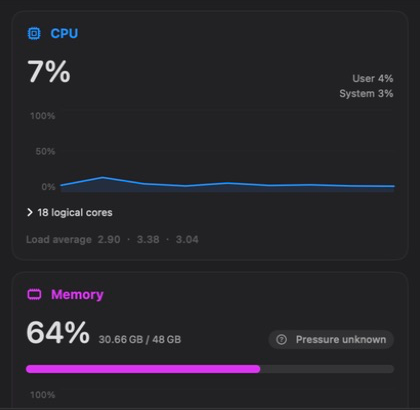
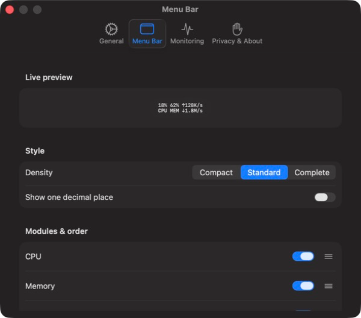

English | [简体中文](README.zh-CN.md)

[Contribution and branch workflow](CONTRIBUTING.md) · `feat/* → dev → main`

# PulseBar

PulseBar is a native, lightweight system monitor for the macOS menu bar. A single compact menu bar item presents CPU, memory, disk, and network status; click it to inspect metric breakdowns, recent trends, and measurement definitions.

The current formal baseline is **v1.0.0 (Build 1)** and requires **macOS 13 or later**.

## Preview

<p align="center">
  
  
</p>

<p align="center"><sub>Live system trends in a focused dashboard, with compact menu-bar controls that stay out of the way.</sub></p>

## Core capabilities

- CPU: total, user, and system usage, logical-core count, load averages, and recent trends.
- Memory: used, available, active, inactive, wired, compressed, purgeable, swap, pressure, and recent trends.
- Disk: local-volume capacity, aggregate read/write rates, and recent trends, with independent I/O degradation.
- Network: primary-interface status, download/upload rates, session totals, and recent trends.
- Menu bar: Compact, Standard, and Complete densities with module visibility and drag-to-reorder controls.
- Runtime controls: adaptive refresh, pause/resume, launch at login, Activity Monitor shortcut, and recovery entry point.
- Accessibility: English, Simplified Chinese, VoiceOver, light/dark appearance, and increased contrast.

## Privacy and resource boundaries

- App Sandbox with no administrator access, privileged helper, Full Disk Access, or Accessibility permission.
- Uses only public Mach, BSD, Foundation, IOKit, Network, SystemConfiguration, and ServiceManagement APIs.
- No accounts, ads, analytics, telemetry, third-party runtime dependencies, or external network connections.
- Metrics are processed in memory only. History uses fixed-capacity ring buffers and is cleared when the app exits.
- Trends use SwiftUI `Shape` / `Path` and are reduced to at most 60 rendered points while preserving local extrema.
- When the menu-bar popover enters its hidden lifecycle, it clears full snapshots and chart presentation state. Post-close CPU and memory recovery for the standalone dashboard window is still being optimized; see the [Quality Report](doc/en/QUALITY_REPORT.md).

See the [Privacy Policy](doc/en/PRIVACY.md) and [Technical Architecture](doc/en/TS/PulseBar_Technical_Architecture_v1.0.md).

## Development requirements

- Xcode 26 or a compatible Swift 6 toolchain.
- macOS 13 SDK or later.
- Builds require no third-party package download or network access.

## Build and test

```bash
swift test
xcodebuild -project PulseBar.xcodeproj -scheme PulseBar -configuration Debug build
Scripts/verify-release.sh
```

`Scripts/verify-release.sh` is the formal local release gate. It covers unit tests, localization and privacy resources, collector benchmarks, Debug/Release builds, signing and sandbox checks, runtime dependencies, offline boundaries, the sandboxed system-API probe, and repository hygiene.

## Local Release package

```bash
Scripts/package-local-release.sh             # Write artifacts to dist/
Scripts/package-local-release.sh --launch    # Relaunch the packaged build
Scripts/package-local-release.sh --verify    # Run the full gate first
```

The script produces an `arm64 + x86_64` Universal, ad-hoc signed `.app` and ZIP. It validates architecture, signing, sandboxing, resources, dependencies, and the extracted archive. Artifact names include the version and Git revision; dirty worktrees receive a `-dirty` suffix.

Local packages are development artifacts. They are not equivalent to Apple distribution signing, notarization, TestFlight, or App Store approval.

## Performance and soak testing

```bash
Scripts/benchmark-metrics.sh 120
Scripts/soak-test.sh 28800 30   # 8 hours, sample every 30 seconds
Scripts/soak-test.sh 86400 60   # 24 hours, sample every 60 seconds
```

The soak script requires an explicit duration and sample interval. See the [Quality and Validation Report](doc/en/QUALITY_REPORT.md) and [Release Checklist](doc/en/RELEASE_CHECKLIST.md) for current evidence and the remaining distribution matrix.

## Project structure

- `PulseBar/App`: application lifecycle, global state, and menu bar entry point.
- `PulseBar/Monitoring`: collectors, sampling coordinator, snapshots, history, and trend reduction.
- `PulseBar/Platform`: public system-API adapters.
- `PulseBar/Features`: dashboard, menu bar, settings, onboarding, and recovery UI.
- `PulseBar/Resources`: app icon, localization, and privacy manifest.
- `PulseBarTests`: collector, scheduling, history, formatting, and settings tests.
- `Tools` / `Scripts`: API probes, performance, sandbox, soak, packaging, and release verification.

## Formal documentation

- [Product Requirements Document (PRD)](doc/en/PRD/PulseBar_PRD_v1.0.md)
- [Technical Architecture (TS)](doc/en/TS/PulseBar_Technical_Architecture_v1.0.md)
- [Implementation Baseline and Milestones](doc/en/IMPLEMENTATION_PLAN.md)
- [System Metrics API Availability Report](doc/en/TS/Milestone_0_API_Availability_Report.md)
- [Quality and Validation Report](doc/en/QUALITY_REPORT.md)
- [Release Checklist](doc/en/RELEASE_CHECKLIST.md)
- [App Store Metadata](doc/en/APP_STORE_METADATA.md)
- [Privacy Policy](doc/en/PRIVACY.md)
- [Support and Known Limitations](doc/en/SUPPORT.md)

## Support

Open a request through [GitHub Issues](https://github.com/xiaolin0429/PulseBar/issues) after reviewing [Support and Known Limitations](doc/en/SUPPORT.md). Never include tokens, passwords, session information, or other sensitive data in a public issue.

Alerts, notifications, persistent history, and export are planned beyond v1.0 and are not part of the current formal scope.
