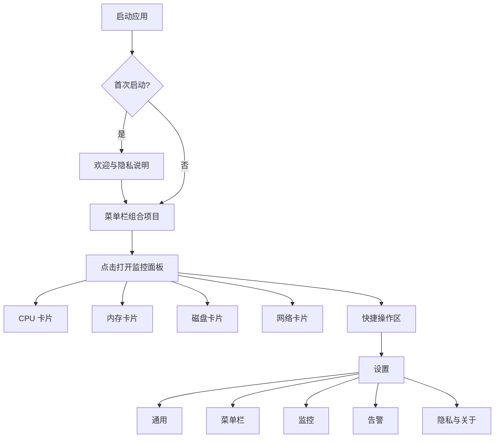

# PulseBar 产品需求文档（PRD）

> 工作名称：**PulseBar**（可后续更名）  
> 文档版本：v1.0  
> 文档日期：2026-08-29  
> 产品状态：方案评审稿  
> 目标平台：macOS 13 Ventura 及以上  
> 默认语言：简体中文；首发同时支持英文  
> 产品形态：常驻菜单栏的原生 macOS 系统监控工具

---

## 1. 产品摘要

PulseBar 是一款使用 Swift 原生开发的轻量级 macOS 系统监控应用。应用常驻屏幕顶部菜单栏，以尽可能少的空间持续展示 CPU、内存、磁盘和网络等核心数据；点击菜单栏项目后，以弹出面板展示最近一段时间的趋势、详细拆分和快捷操作。

产品坚持以下原则：

1. **一眼可读**：用户不打开窗口即可判断系统当前是否正常。
2. **低资源占用**：监控工具自身不能成为显著负担。
3. **指标口径透明**：明确说明“内存占用”“可用内存”“网络速率”等数据如何计算。
4. **隐私优先**：首版完全离线，不上传设备、性能、网络或使用数据。
5. **最小权限**：不申请管理员权限、辅助功能、完全磁盘访问或后台网络权限。
6. **可降级而不失效**：某个硬件指标不可获取时，其余模块仍然正常工作。

---

## 2. 背景与机会

macOS 菜单栏系统监控已经是成熟品类。市场中既有功能丰富的商业产品，也存在免费开源方案，因此本项目的价值不在于“市场上完全没有免费工具”，而在于：

- 为自己提供完全可控的界面、指标口径和功能范围；
- 避免复杂模块、联网服务、账户体系和非必要权限；
- 以现代 SwiftUI 和公开系统 API 构建易维护、易测试的原生应用；
- 形成一款可发布、可开源、可持续演进的小而美工具；
- 将“准确、轻量、透明”作为比“功能数量”更高的优先级。

### 2.1 核心用户痛点

- 只想看 CPU、内存、磁盘和网络，却需要为大量不使用的功能付费。
- 现有工具信息密度过高，菜单栏占用空间大，特别是带刘海的 MacBook。
- 部分工具对“已用内存”“内存压力”“磁盘活动”等指标缺少清晰解释。
- 用户不希望系统监控工具连接服务器、收集遥测或申请管理员权限。
- 监控应用刷新频繁，自身可能产生明显能耗和 CPU 占用。

### 2.2 产品定位

> **一款只做好核心系统指标的、轻量、透明、完全本地的 macOS 菜单栏监控工具。**

### 2.3 差异化

| 维度 | PulseBar 策略 |
|---|---|
| 功能范围 | 聚焦 CPU、内存、磁盘、网络，不在首版堆叠传感器和清理功能 |
| 权限 | 不使用 Root、特权 Helper、辅助功能、完全磁盘访问 |
| 网络 | 首版不发起任何外部网络请求 |
| 指标解释 | 每项指标提供口径说明和不可比性提示 |
| 性能 | 自适应刷新、固定容量历史缓冲区、关闭面板时减少 UI 工作 |
| 商业模式 | 首版免费；是否开源由发布阶段决定，不设置功能诱导式付费墙 |
| 设计 | 单一组合菜单栏项目，提供简洁、标准、完整三种密度预设 |

---

## 3. 产品目标与非目标

### 3.1 目标

#### G1：快速判断系统状态

用户在 2 秒内通过菜单栏判断 CPU、内存和网络是否存在异常，在一次点击后获得详细原因线索。

#### G2：持续运行但低干扰

应用可以全天常驻，不抢占 Dock、不弹出无关窗口、无广告、无账户、无后台上传。

#### G3：指标足够可信

同一采样窗口下，与 macOS 活动监视器及系统命令的趋势一致；对因统计口径不同产生的差异进行解释，而不是伪装成绝对一致。

#### G4：具备发布质量

支持 Apple Silicon 和 Intel Mac，适配浅色、深色、高对比度、VoiceOver、睡眠唤醒、网络切换、外接磁盘等常见场景。

### 3.2 非目标

首版明确不做：

- 系统清理、内存释放、“一键加速”；
- 杀毒、安全扫描或进程拦截；
- 风扇控制、超频、硬件控制；
- CPU/GPU 温度、电压、功耗和 SMC 传感器；
- 全局 GPU 利用率；
- 公网 IP 查询、测速服务器或网络质量探测；
- 云同步、账号体系、远程监控；
- 长期行为画像或远程产品分析；
- 替代活动监视器的完整进程管理能力。

这些功能要么超出“小而美”定位，要么可能依赖不稳定接口、额外权限或外部服务。

---

## 4. 目标用户

### 4.1 开发者与测试工程师

典型需求：编译、自动化测试、虚拟机、模拟器或 Docker 运行时，快速观察 CPU、内存、磁盘和网络变化。

### 4.2 Mac 高级用户

典型需求：长期观察后台异常、下载进度、剩余磁盘空间和内存压力，不希望频繁打开活动监视器。

### 4.3 普通排障用户

典型需求：电脑突然卡顿、风扇加速、下载变慢时，希望先判断问题属于 CPU、内存、磁盘还是网络。

---

## 5. 核心使用场景与用户故事

### S1：日常扫视

- 作为用户，我希望菜单栏直接显示 CPU 和内存百分比，以便不点击任何内容就能判断系统负载。
- 作为笔记本用户，我希望控制菜单栏占用宽度，以免与刘海和其他菜单栏图标冲突。

### S2：定位卡顿

- 当 CPU 突然升高时，我希望点击菜单栏查看最近 60 秒趋势和各核心情况。
- 当内存紧张时，我希望看到内存压力状态、压缩内存和交换空间，而不仅是一个“已用百分比”。

### S3：观察下载与上传

- 当下载文件时，我希望实时看到下载/上传速率，并能区分当前活动网卡。
- 当 Wi‑Fi、以太网或 VPN 切换时，我希望数据自动切换且不产生异常峰值。

### S4：管理磁盘空间

- 我希望在菜单栏或弹出面板看到系统卷剩余空间。
- 我希望查看整机当前读写速率，并在外接磁盘接入或移除时自动刷新列表。

### S5：长期常驻

- 我希望应用登录后自动启动。
- 我希望应用在 Mac 睡眠期间停止采样，唤醒后重新建立统计基线。
- 我希望关闭弹出面板后应用仍监控，但减少图表和布局更新以降低能耗。

---

## 6. 版本范围与优先级

### 6.1 v1.0：P0 必须交付

| 模块 | 功能 |
|---|---|
| 首次启动 | 欢迎页、产品说明、菜单栏显示指引、隐私说明 |
| 菜单栏 | 单一组合项目；CPU、内存、网络、磁盘可选；模块排序；三档密度 |
| CPU | 总占用、用户/系统占用、逐核心占用、最近 60 秒趋势 |
| 内存 | 总量、占用、可用、活跃、非活跃、联动、压缩、交换空间、压力状态 |
| 磁盘 | 系统卷总量/可用量；已挂载本地卷；整机读/写速率；最近 60 秒趋势 |
| 网络 | 在线状态、活动接口、下载/上传速率、会话累计量、最近 60 秒趋势 |
| 弹出面板 | 四张指标卡、暂停/继续、刷新状态、打开活动监视器、设置、退出 |
| 设置 | 登录时启动、刷新策略、显示模块、单位、菜单栏样式、历史窗口 |
| 生命周期 | 睡眠/唤醒、网卡切换、磁盘挂载/卸载、计数器重置处理 |
| 兼容性 | macOS 13+；arm64 与 x86_64；简体中文与英文 |
| 隐私 | 纯本地、无遥测、无广告、无外部请求、无管理员权限 |

### 6.2 v1.1：P1 建议交付

| 模块 | 功能 |
|---|---|
| 本地告警 | CPU 持续高占用、内存压力、低磁盘空间、网络断开 |
| 高级选择 | 手动选择网络接口、磁盘卷；“自动/全部接口”模式 |
| 导出 | 导出当前快照或短时历史为 JSON/CSV，由用户主动选择保存位置 |
| 显示增强 | 自定义阈值、紧凑标签、是否显示小数、单位选择 |
| 可恢复性 | 菜单栏项目被系统隐藏后，重新打开 App 时展示恢复入口 |

### 6.3 v2.0：P2 观察项

- 电池健康、充放电状态和功耗模式；
- macOS 桌面小组件；
- 可选的 24 小时或 7 天本地历史；
- Top CPU/内存进程，只在沙盒、隐私和审核验证通过后加入；
- GPU、温度、风扇与传感器，仅在存在稳定公开接口或单独实验版本时考虑；
- 主题和更丰富的菜单栏图形样式。

---

## 7. 信息架构



---

## 8. 详细功能需求

### 8.1 首次启动与恢复入口

#### 8.1.1 首次启动欢迎页

欢迎页只在首次启动自动出现，包含：

- PulseBar 的作用；
- 默认显示的指标；
- “所有数据仅在本机处理，不会上传”的说明；
- “不需要管理员权限、完全磁盘访问或辅助功能”的说明；
- 菜单栏项目示意；
- “开始使用”按钮；
- “登录时自动启动”开关，默认关闭，交由用户主动选择。

#### 8.1.2 菜单栏可见性提示

应用应：

- 首次启动时展示一次简短指引；
- 当应用检测到菜单栏项目未插入或被移除时，在重新从“应用程序”启动时显示恢复窗口；
- 不使用未公开的系统设置深链；可提供“打开系统设置”按钮和文字路径；
- 不让用户因菜单栏项目不可见而失去退出、设置和恢复入口。

#### 8.1.3 权限策略

- 首次启动不弹出通知权限。
- 只有用户首次启用某条告警时，才请求本地通知权限。
- v1.0 不请求任何文件夹、网络、位置、辅助功能或完全磁盘访问权限。

---

### 8.2 菜单栏组合项目

#### 8.2.1 默认内容

默认展示：

`CPU 18%  MEM 62%  ↓ 1.8 MB/s  ↑ 128 KB/s`

磁盘剩余空间默认只在弹出面板展示，用户可将其加入菜单栏。

#### 8.2.2 密度预设

| 预设 | 示例 | 适用场景 |
|---|---|---|
| 简洁 | `18% · 62% · ↓1.8M` | 刘海屏、菜单栏项目多 |
| 标准 | `CPU 18% · MEM 62% · ↓1.8M ↑128K` | 默认 |
| 完整 | `CPU 18% · MEM 62% · SSD 42G · ↓1.8M ↑128K` | 外接显示器或宽屏 |

#### 8.2.3 可配置项

- 模块显示/隐藏；
- 模块顺序；
- CPU：总百分比或小型条形；
- 内存：占用百分比或压力状态；
- 磁盘：剩余容量或占用百分比；
- 网络：下载、上传或二者；
- 是否显示模块缩写；
- 是否显示小数；
- 分隔符样式；
- 简洁、标准、完整预设。

#### 8.2.4 显示规则

- 菜单栏百分比默认取整数；速率自动选择 B/s、KB/s、MB/s、GB/s。
- 数字使用等宽数字，防止宽度频繁抖动。
- 正常状态默认使用系统单色样式；黄色和红色仅用于警告与严重状态。
- 某指标暂不可用时显示 `—`，不能显示伪造的 `0`。
- 网络和磁盘速率在首个样本时显示 `—`，第二个样本后开始显示。
- 数据更新不使用弹跳、缩放或数字滚动动画。

#### 8.2.5 交互

- 单击：打开/关闭监控弹出面板；
- 辅助功能标签：朗读完整数据，例如“CPU 18%，内存 62%，下载每秒 1.8 兆字节”；
- 应用不依赖右键菜单完成核心操作，以保证 SwiftUI 菜单栏实现的一致性。

---

### 8.3 监控弹出面板

#### 8.3.1 面板规格

- 建议宽度：380–420 pt；
- 最大高度：不超过当前屏幕可用高度；
- 内容超出时使用纵向滚动；
- 默认展示最近 60 秒趋势；可在设置中切换为 2 分钟或 5 分钟；
- 面板打开时使用高频刷新；关闭时只更新菜单栏摘要并停止图表重绘。

#### 8.3.2 顶部摘要区

展示：

- 设备名称；
- 系统运行时间；
- 最后更新时间；
- 当前状态：监控中、已暂停或部分指标不可用；
- 暂停/继续按钮；
- 设置按钮。

#### 8.3.3 CPU 卡片

展示：

- 当前总 CPU 占用；
- 用户态、系统态、空闲占比；
- 最近 60 秒折线图；
- 每个逻辑核心的小型条形图或网格；
- 1、5、15 分钟负载平均值，可作为高级信息折叠展示。

交互：

- 点击卡片展开/收起逐核心区域；
- 图表悬停显示时间点与占用值；
- 不在 v1.0 展示 Top CPU 进程。

#### 8.3.4 内存卡片

展示：

- 占用量 / 物理内存总量；
- 占用百分比；
- 可用内存；
- 活跃、非活跃、联动、压缩、可清除等拆分；
- Swap 已用 / 总量；
- 内存压力状态：正常、警告、严重；
- 最近 60 秒“占用百分比”趋势。

说明入口必须解释：

- macOS 会积极使用空闲内存作为缓存，“空闲很少”不一定代表异常；
- 内存压力、压缩和 Swap 通常比单独的“已用百分比”更能反映问题；
- PulseBar 的“占用”是公开计数器计算值，可能与活动监视器存在小幅口径差异。

#### 8.3.5 磁盘卡片

展示：

- 默认系统数据卷名称；
- 已用、可用、总容量；
- 可用百分比；
- 当前读取速率和写入速率；
- 最近 60 秒读/写趋势；
- 已挂载的本地卷列表；
- 外接卷标识。

规则：

- 容量优先使用系统提供的“可用于重要用途的容量”；
- 整机 I/O 速率按块存储设备累计计数器计算；
- 若某个设备或系统版本无法读取 I/O 计数器，仍展示容量，并在速率位置显示“不可用”；
- 磁盘挂载或卸载后刷新列表，不导致面板崩溃。

#### 8.3.6 网络卡片

展示：

- 网络在线状态；
- 当前接口名称和类型，如 Wi‑Fi、Ethernet、VPN；
- 当前下载与上传速率；
- 本次应用运行期间累计下载/上传；
- 最近 60 秒双线趋势图；
- 本地 IP 可作为折叠信息展示；不请求公网 IP。

接口模式：

- **自动**：跟随系统主接口，默认；
- **手动**：用户指定接口，v1.1；
- **全部接口**：汇总所有活动的非回环接口，v1.1，并提示 VPN 场景可能重复计数。

#### 8.3.7 底部快捷操作

- 打开活动监视器；
- 打开 PulseBar 设置；
- 暂停/继续监控；
- 关于与隐私；
- 退出 PulseBar。

---

### 8.4 设置

设置采用 macOS 原生 Settings 场景，分为五页。

#### 8.4.1 通用

- 登录时启动：默认关闭；
- 启动后显示欢迎页：仅首次；
- 隐藏 Dock 图标：默认开启；
- 语言：跟随系统 / 简体中文 / English；
- 打开应用时：打开监控面板 / 只保持菜单栏；
- 恢复默认设置。

#### 8.4.2 菜单栏

- 密度预设；
- 模块开关与顺序；
- 显示样式；
- 百分比小数位；
- 速率单位；
- 磁盘显示方式；
- 实时预览。

#### 8.4.3 监控

- 刷新策略：自适应、1 秒、2 秒、5 秒；
- 自适应默认：面板打开 1 秒，面板关闭 2 秒；
- 历史窗口：60 秒、120 秒、300 秒；
- 网络接口：自动；
- 默认磁盘卷：系统数据卷；
- 睡眠时暂停：固定开启，不提供关闭选项。

#### 8.4.4 告警（v1.1）

- CPU 高于阈值并持续指定时间；
- 内存压力进入警告或严重；
- 系统卷可用空间低于百分比或容量；
- 网络断开并持续指定时间；
- 通知冷却时间；
- 恢复正常时是否通知。

#### 8.4.5 隐私与关于

- 明确显示“无数据收集”；
- 展示当前版本和构建号；
- 展示各指标的来源和计算口径；
- 查看开源许可；
- 导出诊断快照，v1.1；
- 不包含设备序列号、进程列表、公网 IP 或用户文件路径。

---

### 8.5 刷新与暂停

#### 8.5.1 自适应刷新

默认策略：

- 弹出面板打开：每 1 秒采样和更新；
- 弹出面板关闭：每 2 秒采样和更新菜单栏；
- 系统睡眠：停止计时器；
- 唤醒：清空速率基线，立即采样一次，再从下一周期计算速率；
- 用户手动暂停：停止周期采样，保留最后数据并显示“已暂停”。

#### 8.5.2 数据过期

若最后成功采样距当前超过两倍刷新周期：

- 顶部状态显示“数据已延迟”；
- 对速率指标降低视觉强调；
- 超过 30 秒仍无数据时显示 `—`；
- 不使用过期数据触发告警。

---

### 8.6 本地告警（v1.1）

#### 8.6.1 默认阈值建议

| 告警 | 默认条件 | 默认持续时间 |
|---|---|---|
| CPU 高负载 | CPU ≥ 90% | 30 秒 |
| 内存压力 | 警告或严重 | 10 秒 |
| 磁盘空间不足 | 可用 ≤ 10% 或 ≤ 20 GB | 立即，但每日最多一次 |
| 网络断开 | 无可用路径 | 30 秒 |

#### 8.6.2 防打扰规则

- 条件必须持续满足后才触发；
- 同一告警进入冷却期，默认 10 分钟；
- 恢复正常后重新建立触发资格；
- 休眠、刚唤醒和刚切换接口的短暂异常不触发；
- 通知正文不包含敏感信息；
- 用户拒绝通知权限后，应用内仍显示告警状态，不反复请求权限。

---

## 9. 指标定义与展示口径

### 9.1 CPU

每次读取各逻辑处理器的用户、系统、Nice 和 Idle 累计 Tick。使用相邻两次样本差值计算：

```text
总 Tick 差值 = ΔUser + ΔSystem + ΔNice + ΔIdle
CPU 占用率 = (ΔUser + ΔSystem + ΔNice) / 总 Tick 差值
```

规则：

- 首次采样没有前值，不展示有效占用率；
- 任何 Tick 回退、核心数量变化或唤醒事件均重置基线；
- 总占用按所有核心 Tick 汇总后计算，而不是简单平均已四舍五入的核心百分比。

### 9.2 内存

建议展示以下概念：

- **物理总量**：设备物理内存；
- **可用内存**：Free、Inactive、Speculative、Purgeable 等可较快回收部分的近似合计；
- **占用内存**：物理总量减去可用内存，并限制在 0 到总量范围；
- **联动内存**：不能被换出的内核及驱动内存；
- **压缩内存**：被内存压缩器占用的内存；
- **Swap**：交换空间使用情况；
- **压力状态**：由系统内存压力事件提供正常、警告、严重状态。

产品不得宣称该值与活动监视器逐字节一致。详情页必须说明统计窗口和公开接口口径可能导致差异。

### 9.3 磁盘容量

- 总容量：目标卷总容量；
- 可用容量：优先采用“可用于重要用途”的容量；
- 已用容量：`总容量 - 可用容量`；
- 占用率：`已用容量 / 总容量`。

APFS 快照、可清除空间和系统卷组会导致“Finder、磁盘工具、活动监视器”显示值不完全一致，应用应展示当前 API 口径并避免使用“精确可释放空间”等表述。

### 9.4 磁盘读写速率

从块存储驱动读取“自驱动实例创建以来累计读取/写入字节数”，使用相邻样本差值计算：

```text
读取速率 = max(0, 当前累计读取 - 上次累计读取) / 实际经过秒数
写入速率 = max(0, 当前累计写入 - 上次累计写入) / 实际经过秒数
```

设备新增、移除、计数器回退或系统唤醒时重置对应基线。

### 9.5 网络速率

对选定接口读取累计接收/发送字节数，并按实际时间差计算：

```text
下载速率 = max(0, 当前接收字节 - 上次接收字节) / 实际经过秒数
上传速率 = max(0, 当前发送字节 - 上次发送字节) / 实际经过秒数
```

规则：

- 排除 Loopback；
- 自动模式只统计当前主接口；
- VPN 切换时重置基线；
- “全部接口”可能在 VPN 隧道与物理接口之间重复计数，必须明确提示；
- 会话累计量只统计应用运行期间观察到的差值，不宣称是系统开机以来总量。

### 9.6 单位

默认采用：

- 内存与磁盘容量：IEC，KiB、MiB、GiB、TiB；
- 网络与磁盘速率：SI，KB/s、MB/s、GB/s；
- 设置中允许切换 SI/IEC；
- 菜单栏最多保留一位小数，详情页最多两位。

---

## 10. 异常与边界场景

| 场景 | 期望行为 |
|---|---|
| 首次采样 | 百分比或速率显示 `—`，不显示 0 |
| Mac 睡眠 | 停止采样和告警计时 |
| Mac 唤醒 | 重置 CPU、磁盘、网络基线，防止异常峰值 |
| Wi‑Fi 切换到 Ethernet | 自动切换主接口，首周期显示 `—` |
| VPN 开启/关闭 | 重新选择主接口并重置网络基线 |
| 网络断开 | 在线状态变为离线，速率置 0，趋势可保留 |
| 外接磁盘拔出 | 安全移除卡片，不读取失效引用 |
| I/O 计数器不可读 | 仅该速率显示不可用，容量仍正常 |
| CPU 核心数量变化 | 重置 CPU 基线；理论上极少发生，但必须防御 |
| 计数器回退或溢出 | 丢弃该周期差值，重置基线 |
| 刷新间隔修改 | 立即重建计时器，速率继续按真实时间差计算 |
| 用户改系统时间 | 速率不受影响，因使用单调时钟计算间隔 |
| 菜单栏项目被移除 | 记录可见状态；重新启动时显示恢复窗口 |
| 所有菜单栏模块关闭 | 阻止保存或自动保留应用图标，避免无法操作 |
| 系统高压导致采样延迟 | 按实际时间差计算，不假设固定 1 秒 |

---

## 11. 非功能需求

### 11.1 性能预算

| 指标 | v1.0 目标 |
|---|---|
| 空闲平均 CPU | 默认自适应模式下，Apple Silicon P95 < 0.5% |
| 稳态内存 | < 60 MB；连续运行 8 小时无持续增长 |
| 单次采样耗时 | P95 < 20 ms；不得在主线程执行系统采集 |
| 主线程单次发布与布局 | P95 < 4 ms |
| 菜单栏数据延迟 | 成功采样后 250 ms 内可见 |
| 面板首次打开 | 热启动 < 150 ms，冷启动 < 400 ms |
| 唤醒恢复 | 5 秒内恢复正常速率显示 |
| 崩溃率 | 内测阶段 100 小时连续运行无崩溃；发布后目标无崩溃会话 ≥ 99.9% |

以上是验收目标，不代表所有硬件上的绝对承诺；需要在不同芯片和系统版本上基准测试。

### 11.2 稳定性

- 单个采集器失败不影响其他采集器；
- 所有 C API 指针、迭代器和内存都必须成对释放；
- 固定长度环形缓冲区，不能随运行时间无限增长；
- 睡眠、唤醒和接口切换后不得出现巨量速率；
- 运行 24 小时无明显内存泄漏或句柄增长。

### 11.3 能耗

- 默认不高于每秒一次系统唤醒；面板关闭时默认每两秒一次；
- 周期计时器设置合理容差，允许系统合并唤醒；
- 不通过启动 shell 命令采样；
- 不为每个指标创建独立高频计时器；
- 图表只在面板可见时刷新布局；
- 监听事件时优先使用系统通知和 Dispatch Source，而非额外轮询。

### 11.4 兼容性

- 最低 macOS 13；
- Apple Silicon arm64；
- Intel x86_64，首版建议保留；
- 浅色、深色、增加对比度、减少动态效果；
- 多显示器、带刘海 MacBook、自动隐藏菜单栏；
- 至少覆盖 macOS 13、14、15、26 的实机或虚拟化测试。

---

## 12. 隐私、安全与合规

### 12.1 数据处理

- 所有系统数据仅驻留在内存；
- v1.0 不保存历史数据到磁盘；
- 设置仅保存于本地 UserDefaults；
- 不采集序列号、Apple ID、文件内容、浏览历史、进程命令行或公网 IP；
- 不集成广告、崩溃上报或第三方分析 SDK；
- 不发起外部网络连接。

### 12.2 权限与沙盒

- Mac App Store 构建开启 App Sandbox；
- 不请求管理员权限；
- 不安装 LaunchDaemon、内核扩展、系统扩展或特权 Helper；
- 不请求完全磁盘访问；
- 不请求辅助功能、屏幕录制、自动化或位置权限；
- 登录时启动使用系统提供的 ServiceManagement 能力；
- 本地通知仅在用户启用告警时请求。

### 12.3 发布策略

优先推荐：

1. **Mac App Store**：沙盒、系统自动更新、用户信任成本低；
2. **Developer ID 直接分发**：作为后续可选渠道，必须启用 Hardened Runtime、签名与公证；
3. 首版两个渠道保持同一核心功能，不通过直接分发版本绕过公开 API 限制。

App Store 隐私信息应按实际实现申报。若始终不收集数据，可申报“Data Not Collected”，同时仍提供公开隐私政策页面。

---

## 13. 可访问性与本地化

### 13.1 可访问性

- 所有菜单栏缩写提供完整 VoiceOver 标签；
- 不只依赖颜色表达正常/警告/严重；
- 支持键盘焦点与标准 Tab 顺序；
- 数字与图表提供文本等价描述；
- 遵循“减少动态效果”；
- 高对比度下仍可区分曲线和状态；
- 图表使用线型、标签和数值辅助，而非只靠颜色。

### 13.2 本地化

首发语言：

- 简体中文；
- English。

要求：

- 使用 String Catalog；
- 单位、数字和小数点跟随 Locale；
- 菜单栏短标签单独本地化，不能直接截断长文案；
- 为德语、法语等较长文本预留弹性布局。

---

## 14. 验收标准

### AC-01 菜单栏启动

**Given** 用户首次安装并完成欢迎页  
**When** 应用进入常驻状态  
**Then** 菜单栏出现 PulseBar 项目，默认显示 CPU、内存、网络，且 Dock 中不保留普通应用图标。

### AC-02 CPU 采样

**Given** 已取得两个连续 CPU 样本  
**When** 用户运行一个高负载任务  
**Then** 菜单栏和详情页 CPU 曲线在下一个刷新周期明显上升，不出现负数、NaN 或超过 100% 的总占用。

### AC-03 内存展示

**Given** 应用正常运行  
**When** 用户打开内存卡片  
**Then** 可看到物理总量、占用、可用、联动、压缩、Swap 和压力状态，并能查看口径说明。

### AC-04 网络切换

**Given** 当前使用 Wi‑Fi  
**When** 用户连接 Ethernet 或启用 VPN，系统主接口改变  
**Then** PulseBar 自动切换接口；切换后的首个速率样本显示 `—`，后续不出现由旧、新计数器相减形成的巨大峰值。

### AC-05 睡眠唤醒

**Given** 应用正在显示网络和磁盘速率  
**When** Mac 睡眠 5 分钟后唤醒  
**Then** 睡眠期间无周期采样；唤醒后重置基线，5 秒内恢复正常数据显示，无异常高峰。

### AC-06 磁盘降级

**Given** 某设备不提供可读 I/O 统计  
**When** 打开磁盘卡片  
**Then** 容量信息正常显示，读写速率显示“不可用”，其他模块不受影响。

### AC-07 设置持久化

**Given** 用户修改模块顺序、刷新策略和单位  
**When** 退出并重新启动应用  
**Then** 所有设置保持，且菜单栏预览与实际显示一致。

### AC-08 登录时启动

**Given** 用户开启“登录时启动”并完成系统批准  
**When** 用户重新登录 macOS  
**Then** PulseBar 自动启动，且不会打开普通主窗口打扰用户。

### AC-09 隐私

**Given** v1.0 Release 构建运行 30 分钟  
**When** 使用网络监控工具检查连接  
**Then** PulseBar 不建立任何外部网络连接。

### AC-10 性能

**Given** 默认自适应刷新和四个模块均开启  
**When** 在目标设备连续运行 8 小时  
**Then** 达到性能预算，内存无持续增长，应用本身不会成为活动监视器中的显著负载源。

---

## 15. 测试范围

### 15.1 功能测试

- 菜单栏模块组合、排序、格式和预设；
- CPU、内存、磁盘和网络采样；
- 图表历史窗口；
- 设置持久化；
- 暂停、继续、退出、打开活动监视器；
- 登录时启动；
- 菜单栏项目被系统隐藏后的恢复流程。

### 15.2 场景测试

- Wi‑Fi / Ethernet / VPN 切换；
- 网络断开和恢复；
- 外接 SSD、U 盘、网络卷、磁盘映像；
- Mac 睡眠、合盖、唤醒；
- 多显示器和菜单栏自动隐藏；
- 刘海屏空间不足；
- 系统高 CPU、高内存压力和低磁盘空间；
- 不同 Locale、12/24 小时制和系统时间变更。

### 15.3 非功能测试

- CPU、内存、能耗、Idle Wake Ups；
- 8 小时、24 小时稳定性；
- Instruments Leaks、Allocations、Time Profiler、Energy Log；
- VoiceOver、键盘、增加对比度、减少动态效果；
- 沙盒 Release 构建验证，而非只验证 Debug 构建。

---

## 16. 发布计划

### 阶段 A：技术验证

交付物：

- 四类指标的命令行或最小 UI 原型；
- 采样准确性对比；
- 沙盒环境下 API 可用性报告；
- Apple Silicon 与 Intel 初步验证；
- 性能基线。

退出条件：四个核心采集器均可稳定工作，或明确存在可接受的降级方案。

### 阶段 B：Alpha

交付物：

- 菜单栏组合项目；
- 监控弹出面板；
- 60 秒趋势；
- 基础设置；
- 睡眠/唤醒与接口切换。

退出条件：连续运行 8 小时无崩溃，无明显内存增长。

### 阶段 C：Beta

交付物：

- 欢迎与恢复流程；
- 登录时启动；
- 中英文；
- 完整可访问性；
- 性能优化；
- TestFlight for Mac 或签名测试包。

退出条件：主要验收标准通过，P0 缺陷清零，P1 严重缺陷清零。

### 阶段 D：v1.0

交付物：

- Mac App Store Release；
- 隐私政策；
- App Store 截图和说明；
- 已知限制；
- 支持页面。

---

## 17. 风险与应对

| 风险 | 影响 | 应对 |
|---|---|---|
| 指标与活动监视器不完全一致 | 用户认为“不准确” | 公布公式、统一采样窗口、写明口径差异，趋势优先 |
| IOKit 磁盘统计在部分设备不可用 | 磁盘速率缺失 | 采集器返回可用性状态；容量模块独立；建立设备测试矩阵 |
| VPN 导致网络重复计数 | 速率偏高 | 默认只统计主接口；“全部接口”明确警告 |
| 频繁刷新提高能耗 | 工具反而耗资源 | 单一计时器、自适应周期、10% 容差、面板关闭停止图表重绘 |
| 菜单栏空间不足 | 图标被隐藏或挤压 | 三档密度、模块优先级、首次引导、预览 |
| 菜单栏项目被系统或用户隐藏 | 用户找不到应用 | 首次欢迎、重新打开恢复窗口、保留设置入口 |
| SwiftUI 菜单栏行为在新系统变化 | 交互回归 | 封装 MenuBarPresenter；保留切换 NSStatusItem 的架构边界 |
| 沙盒审核与实机行为差异 | 上架延期 | 从第一天使用 App Store 沙盒配置开发；Release 构建持续验证 |
| 长期运行内存增长 | 影响信任 | 固定容量 Ring Buffer、泄漏测试、24 小时稳定性测试 |

---

## 18. 产品成功指标

由于首版不使用远程分析，以下指标主要通过发布前测试、用户主动反馈和商店评价评估：

- 核心任务成功率：首次启动后能看到菜单栏数据 ≥ 98%；
- 默认配置下，2 秒内读懂当前状态的可用性测试通过率 ≥ 90%；
- 8 小时稳定性测试无崩溃率 100%；
- 空闲性能预算通过率 ≥ 95% 的目标测试设备；
- 与活动监视器对比时，CPU 和网络在统一采样窗口内趋势一致；
- “数据不准确”“应用自身耗资源”“找不到菜单栏图标”成为重点监控的反馈主题。

不为了获得统计数据而在 v1.0 引入遥测 SDK。

---

## 19. App Store 信息草案

- **名称**：PulseBar（工作名）
- **副标题**：菜单栏中的轻量系统监控
- **分类**：Utilities / 工具
- **一句话介绍**：实时查看 CPU、内存、磁盘和网络，完全本地，无广告，无账户。
- **核心卖点**：
  - 一眼查看关键系统状态；
  - 最近 60 秒趋势；
  - 自适应刷新，低资源占用；
  - 不收集数据，不需要管理员权限；
  - 原生适配 macOS 深色模式和辅助功能。
- **隐私标签目标**：Data Not Collected，最终以实际代码和第三方依赖为准。

---

## 20. 最终产品决策

1. 最低系统版本定为 **macOS 13**，统一使用 MenuBarExtra、Swift Charts 和 SMAppService。
2. 首版使用 **一个组合菜单栏项目**，不创建四个独立图标。
3. 首版 **不使用第三方依赖**，减少供应链、体积和隐私复杂度。
4. 首版 **不保存长期历史**，历史仅存在固定容量内存缓冲区。
5. 首版 **完全离线**，不查询公网 IP、不检查更新、不上传崩溃和性能数据。
6. 首版 **公开 API 优先**；任何不可稳定获取的指标必须可降级，不能通过私有框架强行实现。
7. 首版默认采用 **自适应 1 秒/2 秒刷新**，以准确性和能耗平衡为目标。
8. CPU、内存、磁盘和网络的计算公式均在产品内可查看。

---

## 21. 参考依据

- Apple Developer Documentation：MenuBarExtra、MenuBarExtraStyle.window、Swift Charts、App Sandbox、SMAppService。
- Apple Developer Documentation：Mach 处理器与虚拟内存统计接口、Dispatch Memory Pressure Source。
- Apple Developer Documentation：FileManager 与 URL 卷容量资源值。
- Apple Developer Documentation：IOBlockStorageDriver 统计键及累计读写字节。
- Apple Developer Documentation Archive：getifaddrs(3)。
- Apple Human Interface Guidelines：The menu bar。
- 竞品公开资料：iStat Menus、Stats、MenuMeters、Activity Bar。
