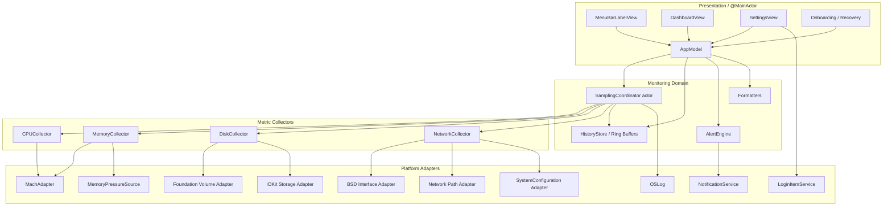
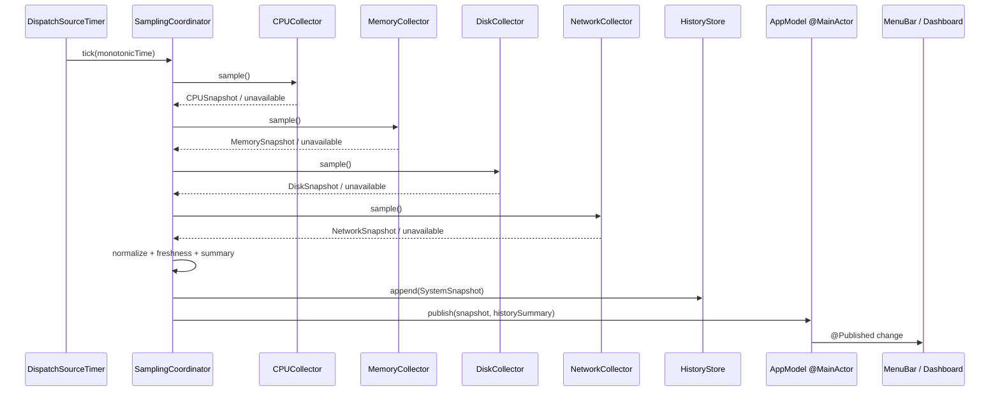
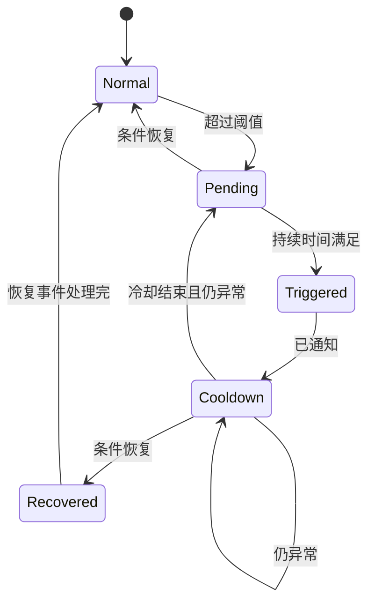
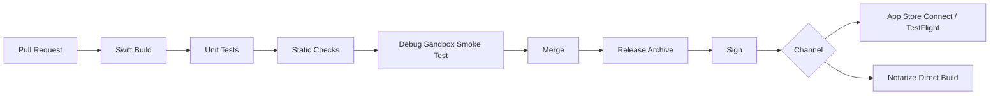

# PulseBar 技术架构设计文档

> 工作名称：**PulseBar**  
> 文档版本：v1.0  
> 文档日期：2026-08-29  
> 架构状态：方案评审稿  
> 目标平台：macOS 13 Ventura 及以上  
> 开发语言：Swift，Swift 6 语言模式  
> UI 技术：SwiftUI 为主，AppKit 负责必要的 macOS 生命周期与系统交互  
> 发布基线：Mac App Store 沙盒兼容、无特权 Helper、无第三方运行时依赖

---

## 1. 架构摘要

PulseBar 采用“**单进程、模块化采集、统一调度、内存历史、单向状态发布**”架构：

- 使用 SwiftUI `MenuBarExtra` 构建单一组合菜单栏项目；
- 使用 `.window` 样式展示可交互弹出面板；
- 通过一个 `SamplingCoordinator` 统一驱动 CPU、内存、磁盘和网络采集；
- 所有底层采集在非主线程、串行受控环境中执行；
- 使用单调时钟计算相邻样本间隔，避免系统时间变化影响速率；
- 使用固定长度 Ring Buffer 保存 60–300 秒历史，避免内存无限增长；
- 通过 `@MainActor` 的 `AppModel` 向 SwiftUI 发布不可变快照；
- 设置使用 UserDefaults / `@AppStorage`；v1.0 不引入数据库；
- 使用公开的 Mach、BSD、Foundation、IOKit、Network、SystemConfiguration、ServiceManagement 和 UserNotifications 接口；
- 单一采集器失败时降级，不拖垮整个应用。

---

## 2. 架构目标

### 2.1 功能目标

- 稳定采集整机 CPU、内存、磁盘容量与 I/O、网络状态与吞吐；
- 支持菜单栏摘要和弹出面板详细趋势；
- 支持睡眠/唤醒、接口切换、磁盘挂载/卸载；
- 支持登录时启动、设置持久化、本地告警；
- 支持 arm64 和 x86_64。

### 2.2 质量目标

- 默认配置下低 CPU、低内存、低 Idle Wake Ups；
- 数据采集不阻塞主线程；
- 无长期增长的数组、日志、文件或系统句柄；
- 可通过协议和原始计数器注入进行单元测试；
- 系统 API 调用与 UI 解耦，便于未来替换 `MenuBarExtra` 或单个采集实现；
- 从第一天就在 App Sandbox Release 配置中可运行。

### 2.3 安全目标

- 不执行 shell 命令采样；
- 不调用私有 Framework 或私有符号；
- 不使用 Root、sudo、LaunchDaemon、特权 Helper、内核扩展或系统扩展；
- 不建立外部网络连接；
- 不读取用户文件内容；
- 日志不写入 IP、设备标识或用户路径等敏感内容。

---

## 3. 关键技术决策

| ADR | 决策 | 原因 |
|---|---|---|
| ADR-001 | 最低 macOS 13 | MenuBarExtra、Swift Charts、SMAppService 在该版本形成统一基线 |
| ADR-002 | SwiftUI + 少量 AppKit | SwiftUI 提升界面开发效率；AppKit 处理应用激活、重开和 NSWorkspace 等能力 |
| ADR-003 | 单一组合 MenuBarExtra | 节省菜单栏空间，降低多状态项管理复杂度 |
| ADR-004 | 公开 API 优先 | 降低系统升级失效和 App Store 审核风险 |
| ADR-005 | 单一统一采样调度器 | 减少计时器和系统唤醒，统一处理睡眠、暂停与刷新间隔 |
| ADR-006 | 采集器保存自己的前值基线 | CPU、磁盘、网络均需要相邻累计计数器差值，职责清晰 |
| ADR-007 | 历史仅驻留内存 | v1.0 不需要数据库，降低 I/O、隐私和迁移成本 |
| ADR-008 | 无第三方依赖 | 降低供应链风险、二进制体积、隐私申报和升级维护成本 |
| ADR-009 | `ObservableObject` 作为 UI 状态基线 | 兼容 macOS 13；未来提高最低版本后可迁移 Observation |
| ADR-010 | Release 构建默认开启沙盒 | 防止 Debug 可用、上架构建不可用的后期风险 |

---

## 4. 技术栈

| 层级 | 技术 | 用途 |
|---|---|---|
| 语言 | Swift 6 语言模式 | 严格并发检查、类型安全 |
| UI | SwiftUI | 菜单栏标签、弹出面板、设置、图表容器 |
| macOS UI 补充 | AppKit | 应用激活策略、重新打开、NSWorkspace、必要窗口控制 |
| 图表 | Swift Charts | CPU、内存、磁盘、网络趋势图 |
| CPU/内存 | Darwin / Mach | 主机处理器 Tick、虚拟内存统计、页大小 |
| 内存压力 | Dispatch | 系统内存压力事件 |
| 磁盘容量 | Foundation | 已挂载卷、总容量、可用容量 |
| 磁盘 I/O | IOKit | 块存储驱动累计读取/写入字节 |
| 网络吞吐 | BSD `getifaddrs` | 接口累计接收/发送字节 |
| 网络路径 | Network | 在线状态、活动接口类型变化 |
| 主接口 | SystemConfiguration | 读取系统动态网络配置和 PrimaryInterface |
| 登录启动 | ServiceManagement | `SMAppService.mainApp` |
| 通知 | UserNotifications | v1.1 本地告警 |
| 日志 | OSLog | 分类日志、性能与错误诊断 |
| 设置 | UserDefaults / AppStorage | 轻量配置持久化 |
| 测试 | XCTest / XCUITest | 单元、集成、UI、性能测试 |

---

## 5. 总体架构



### 5.1 依赖方向

依赖必须单向：

```text
Presentation → Domain → Platform
```

- Platform 不依赖 SwiftUI；
- Collector 不直接更新 UI；
- View 不直接调用 Mach、IOKit 或 BSD API；
- 设置改变后由 AppModel 向 SamplingCoordinator 发出配置命令；
- 所有对 UI 可见的数据均通过不可变 `SystemSnapshot` 发布。

---

## 6. 模块职责

### 6.1 App 层

#### `PulseBarApp`

- 声明 `MenuBarExtra`、`Settings` 和首次启动/恢复窗口；
- 注入唯一的 `AppModel`；
- 配置菜单栏 `.window` 风格；
- 保证应用在菜单栏不可见时仍存在恢复入口。

#### `AppDelegate`

仅承担 SwiftUI App 生命周期不方便处理的事项：

- 设置 `NSApplication` 激活策略；
- 响应从 Finder/Dock/Spotlight 再次打开应用；
- 转发应用终止、睡眠/唤醒相关生命周期；
- 必要时打开欢迎或恢复窗口。

不在 AppDelegate 中实现采样逻辑。

### 6.2 Presentation 层

#### `MenuBarLabelView`

- 只依赖 `MenuBarSummary` 和 `MenuBarPreferences`；
- 使用 `monospacedDigit`；
- 不执行格式化以外的重计算；
- 提供完整无障碍标签；
- 数据变更时禁止隐式动画。

#### `DashboardView`

- 组合 CPU、内存、磁盘、网络卡片；
- 面板出现/消失时通知 AppModel，以切换自适应刷新策略；
- 图表读取固定窗口的只读数组；
- 不持有 Collector。

#### `SettingsView`

- 通过 `SettingsStore` 修改配置；
- 配置更改即时预览；
- 对需要系统批准的行为展示真实状态和错误；
- 不直接调用 `SMAppService` 或通知 API，由服务层封装。

### 6.3 Domain 层

#### `SamplingCoordinator`

- 唯一周期采样入口；
- 拥有一个 Dispatch Source Timer 或等价的受控循环；
- 串行调用各采集器，避免同一采集器基线竞争；
- 汇总为 `SystemSnapshot`；
- 写入 HistoryStore；
- 将摘要发送给 AppModel；
- 处理暂停、继续、间隔变更、睡眠、唤醒和手动刷新。

#### `HistoryStore`

- 为每条时间序列维护固定容量 Ring Buffer；
- 支持 60、120、300 秒窗口；
- 在刷新周期变化时按时间戳裁剪，而非假设固定样本数；
- 对 UI 返回值语义拷贝，不能暴露内部可变缓冲区。

#### `AlertEngine`

- 接收每次有效快照；
- 为每条规则维护状态机；
- 忽略过期、刚唤醒、基线重建和采集失败的样本；
- 将触发事件交给 NotificationService。

#### `SettingsStore`

- 管理默认值、迁移、校验和持久化；
- 对不合法组合进行修正，例如禁止关闭所有菜单栏模块；
- 设置 schema 带版本号，以支持未来迁移。

### 6.4 Platform 层

- 将 C API、Core Foundation 类型、IOKit 迭代器和指针处理封装在最小边界；
- 向 Domain 暴露纯 Swift、`Sendable` 的值类型；
- 每个 Adapter 单独负责资源释放和错误映射；
- 禁止 UI 层出现 `UnsafePointer`、`io_iterator_t` 或 Mach 类型。

---

## 7. 数据流



### 7.1 为什么默认串行采集

四个采集操作都应是短时、本地、无阻塞网络操作。串行执行的优点：

- 只需一个调度点和一次系统唤醒；
- 前值基线天然串行，不需要额外锁；
- 采样时间戳更容易定义；
- 避免 IOKit、Mach 和网络接口同时争抢资源；
- 对四个采集器总耗时设置统一预算。

若实测磁盘 IOKit 枚举在部分机器明显较慢，可将“卷发现”与“高频累计计数读取”分离：

- 卷发现：事件驱动或每 30 秒低频执行；
- 累计读写计数：每个采样周期执行；
- 不直接把所有采集器改为并发。

---

## 8. 并发与调度设计

### 8.1 Actor 边界

建议：

```swift
actor SamplingCoordinator {
    private let cpuCollector: CPUCollector
    private let memoryCollector: MemoryCollector
    private let diskCollector: DiskCollector
    private let networkCollector: NetworkCollector
    private var mode: SamplingMode
    private var timer: DispatchSourceTimer?
}
```

`SamplingCoordinator` 负责保护：

- Collector 的前值；
- 当前刷新策略；
- 暂停状态；
- 唤醒代次；
- 采样序号；
- HistoryStore 写入顺序。

UI 状态：

```swift
@MainActor
final class AppModel: ObservableObject {
    @Published private(set) var latest: SystemSnapshot?
    @Published private(set) var menuBarSummary: MenuBarSummary
    @Published private(set) var history: DashboardHistory
}
```

### 8.2 计时器

使用一个 `DispatchSourceTimer`：

- Queue QoS：`.utility`；
- 自适应模式：面板打开 1 秒，关闭 2 秒；
- 手动模式：1、2、5 秒；
- Leeway：刷新间隔的约 10%；
- 下一次速率按真实 `ContinuousClock` 时间差计算；
- 修改间隔时取消旧 Timer，再创建新 Timer；
- 应用暂停或睡眠时取消 Timer，而不是保留空转回调。

### 8.3 单调时钟

每个原始样本包含：

- `ContinuousClock.Instant`：用于差值、速率和持续阈值；
- `Date`：仅用于图表横轴和用户可读时间。

严禁使用 `Date().timeIntervalSince(previousDate)` 作为速率唯一时间来源，以免用户修改系统时间或 NTP 校正造成负值和尖峰。

### 8.4 睡眠与唤醒

监听 `NSWorkspace` 睡眠/唤醒通知：

睡眠：

1. 标记状态为 sleeping；
2. 停止 Timer；
3. 暂停告警持续计时；
4. 不清空已显示历史。

唤醒：

1. 所有有前值的 Collector 执行 `resetBaseline()`；
2. 立即执行一次预热样本；
3. 第一个 CPU、磁盘、网络差值标为 unavailable；
4. 下一周期开始输出有效速率；
5. 重启 Timer；
6. 设置短暂告警抑制窗口，建议 5–10 秒。

---

## 9. 领域模型

建议使用纯值类型：

```swift
struct SystemSnapshot: Sendable, Equatable {
    let sequence: UInt64
    let wallTime: Date
    let monotonicTime: ContinuousClock.Instant
    let cpu: MetricValue<CPUSnapshot>
    let memory: MetricValue<MemorySnapshot>
    let disk: MetricValue<DiskSnapshot>
    let network: MetricValue<NetworkSnapshot>
}

enum MetricValue<Value: Sendable & Equatable>: Sendable, Equatable {
    case available(Value)
    case warmingUp
    case unavailable(MetricFailure)
    case stale(Value, age: Duration)
}

struct MetricFailure: Sendable, Equatable {
    let code: Code
    let userMessageKey: String
    let debugContext: String?

    enum Code: String, Sendable {
        case permissionDenied
        case unsupported
        case systemCallFailed
        case invalidCounter
        case sourceMissing
    }
}
```

### 9.1 CPU 模型

```swift
struct CPUSnapshot: Sendable, Equatable {
    let totalUsage: Double          // 0...1
    let userUsage: Double
    let systemUsage: Double
    let niceUsage: Double
    let idleUsage: Double
    let perCoreUsage: [Double]
    let loadAverage1m: Double?
    let loadAverage5m: Double?
    let loadAverage15m: Double?
}
```

### 9.2 内存模型

```swift
struct MemorySnapshot: Sendable, Equatable {
    let physicalTotal: UInt64
    let usedApproximation: UInt64
    let availableApproximation: UInt64
    let free: UInt64
    let active: UInt64
    let inactive: UInt64
    let speculative: UInt64
    let wired: UInt64
    let compressed: UInt64
    let purgeable: UInt64
    let swapUsed: UInt64?
    let swapTotal: UInt64?
    let pressure: MemoryPressureState
}

enum MemoryPressureState: String, Sendable {
    case normal
    case warning
    case critical
    case unknown
}
```

### 9.3 磁盘模型

```swift
struct DiskSnapshot: Sendable, Equatable {
    let primaryVolumeID: String?
    let volumes: [VolumeSnapshot]
    let aggregateReadBytesPerSecond: Double?
    let aggregateWriteBytesPerSecond: Double?
}

struct VolumeSnapshot: Identifiable, Sendable, Equatable {
    let id: String
    let name: String
    let mountPathDisplayName: String
    let totalCapacity: UInt64
    let availableCapacity: UInt64
    let isInternal: Bool?
    let isLocal: Bool?
    let isRemovable: Bool?
}
```

### 9.4 网络模型

```swift
struct NetworkSnapshot: Sendable, Equatable {
    let pathStatus: PathStatus
    let interface: NetworkInterfaceSnapshot?
    let downloadBytesPerSecond: Double?
    let uploadBytesPerSecond: Double?
    let sessionDownloadedBytes: UInt64
    let sessionUploadedBytes: UInt64
    let localAddresses: [String]
}

struct NetworkInterfaceSnapshot: Sendable, Equatable {
    let name: String
    let kind: InterfaceKind
    let receivedBytes: UInt64
    let sentBytes: UInt64
}
```

---

## 10. CPU 采集设计

### 10.1 数据来源

使用 Mach 主机处理器接口：

- `mach_host_self()`；
- `host_processor_info(..., PROCESSOR_CPU_LOAD_INFO, ...)`；
- `processor_cpu_load_info` 中的 User、System、Nice、Idle 累计 Tick。

### 10.2 算法

对每个核心：

```text
deltaUser   = current.user   - previous.user
deltaSystem = current.system - previous.system
deltaNice   = current.nice   - previous.nice
deltaIdle   = current.idle   - previous.idle
deltaTotal  = deltaUser + deltaSystem + deltaNice + deltaIdle
usage       = (deltaUser + deltaSystem + deltaNice) / deltaTotal
```

总 CPU：先把所有核心的各类 Tick 差值求和，再计算比例。

### 10.3 防御规则

- 首次样本返回 `.warmingUp`；
- 核心数变化时丢弃前值并预热；
- 当前计数小于前值时视为重置；
- `deltaTotal == 0` 时返回上次有效值的 stale 状态或 unavailable，不除以零；
- 所有结果 clamp 到 `0...1`；
- Mach 返回的动态内存必须使用对应大小执行 `vm_deallocate`；
- 任何指针解析失败只影响 CPU 模块。

### 10.4 负载平均值

使用 `getloadavg` 获取 1、5、15 分钟系统负载，作为详情页补充信息，不与 CPU 百分比混为同一概念。

---

## 11. 内存采集设计

### 11.1 数据来源

- `ProcessInfo.processInfo.physicalMemory`：物理总量；
- `host_page_size`：页大小；
- `host_statistics64(..., HOST_VM_INFO64, ...)`：虚拟内存页计数；
- `sysctlbyname("vm.swapusage", ...)`：Swap 使用；
- `DispatchSource.makeMemoryPressureSource`：正常、警告、严重事件。

### 11.2 字节转换

所有页计数使用溢出安全转换：

```text
bytes = UInt64(pageCount) × UInt64(pageSize)
```

乘法溢出时该字段不可用，不能截断。

### 11.3 口径

建议：

```text
available ≈ free + inactive + speculative + purgeable
used ≈ physicalTotal - min(available, physicalTotal)
usagePercent = used / physicalTotal
```

详情页单独展示 wired、compressed、active 等原始公开字段。

说明：

- 这是为了提供稳定、可解释的近似值；
- 不尝试反向复制活动监视器未公开的全部内部算法；
- 所有拆分值之和不强制等于物理总量，因为不同计数可能存在语义交叠和瞬时变化；
- UI 不把“Free 很少”直接标红，告警优先使用系统压力状态。

### 11.4 内存压力

MemoryPressureService 生命周期与应用一致：

- 启动时先设为 `.unknown`，收到首个状态事件后再更新；
- 收到 Dispatch 事件后更新状态；
- 同一事件去重；
- 告警引擎根据事件状态而非自制单一百分比判断严重程度；
- 不能把低层 `sysctl` 值冒充活动监视器的精确“压力百分比”。

---

## 12. 磁盘采集设计

磁盘模块拆分为两个子采集器，互不依赖。

### 12.1 `VolumeCapacityCollector`

使用 Foundation：

- `FileManager.mountedVolumeURLs`；
- URL Resource Values：卷名称、总容量、可用容量、是否本地、是否内部、是否可移除；
- 优先读取 `volumeAvailableCapacityForImportantUsage`；
- 缺失时回退到普通 available capacity；
- 系统主卷可通过根路径 `/` 或系统数据卷映射确定。

#### 12.1.1 枚举频率

- 启动时立即枚举；
- 收到挂载/卸载工作区通知时重枚举；
- 作为兜底每 30 秒低频刷新；
- 容量值可每 5–10 秒更新，不必每 1 秒完整枚举所有卷。

### 12.2 `DiskIOCollector`

使用公开 IOKit 注册表和块存储统计键：

- 匹配 `IOBlockStorageDriver` 服务；
- 读取 `kIOBlockStorageDriverStatisticsKey`；
- 读取累计 `Bytes Read` 与 `Bytes Written` 对应公开键；
- 聚合选定物理/本地设备；
- 使用相邻样本和真实时间差计算速率。

#### 12.2.1 资源管理

- `io_iterator_t` 使用后必须 `IOObjectRelease`；
- 每个 `io_registry_entry_t` 使用后释放；
- Core Foundation 属性使用 ARC 桥接或显式生命周期，不能双重释放；
- 不在 UI 层保留 Registry Entry 句柄；
- 不每秒重建与容量无关的复杂设备拓扑，可缓存稳定标识并响应设备变化。

#### 12.2.2 聚合策略

v1.0 默认“整机块存储活动”：

- 聚合可读到的块存储驱动累计字节；
- 对同一稳定设备 ID 去重；
- 过滤明显不应计入的无效或重复节点；
- 外接存储默认计入整机活动，详情页可显示设备来源；
- 若后续需要“系统盘活动”，建立卷 BSD 名称到 IOMedia / 驱动的映射，不能用路径字符串猜测。

#### 12.2.3 降级

出现以下情况时，`DiskIOCollector` 返回 `.unavailable(.unsupported)`，但 `VolumeCapacityCollector` 继续工作：

- 找不到匹配服务；
- Statistics 字典缺少公开键；
- 沙盒或系统版本拒绝读取；
- 数据类型不符合预期；
- 所有设备计数均无效。

---

## 13. 网络采集设计

网络模块分成路径状态、主接口选择和流量计数三部分。

### 13.1 `NetworkPathService`

使用 `NWPathMonitor`：

- 监听 online / unsatisfied / requiresConnection；
- 监听 Wi‑Fi、Ethernet、Wired、Other 等接口类型变化；
- 在独立串行队列启动；
- 只用于路径状态和触发接口重选，不用于吞吐速率。

### 13.2 `PrimaryInterfaceResolver`

使用 SystemConfiguration 动态存储：

- 读取全局 IPv4/IPv6 网络状态；
- 使用系统 `PrimaryInterface` 属性确定接口名；
- 网络配置变化时重新解析；
- 找不到主接口时，回退到 NWPath 当前使用的接口类型加上 `getifaddrs` 活跃接口候选；
- 回退选择必须可预测并写入 Debug 日志。

### 13.3 `InterfaceCounterReader`

使用 `getifaddrs`：

- 遍历接口链表；
- 只处理 `AF_LINK` 且 `ifa_data != nil` 的条目；
- 读取 `if_data` 中累计输入/输出字节；
- 排除 `IFF_LOOPBACK`；
- 自动模式只返回 PrimaryInterface；
- 手动模式返回指定接口；
- 全部模式汇总活动非回环接口。

必须始终调用 `freeifaddrs`。

### 13.4 VPN 与重复计数

默认自动模式：

- 如果系统主接口是 `utun*`，只计算该接口；
- 不再同时加上物理 `en*`，避免同一流量在隧道层和链路层重复计算；
- 切换主接口后清空前值，下一有效周期再显示速率。

“全部接口”是高级模式，UI 明确提示 VPN、虚拟机、桥接网络可能产生重复计数。

### 13.5 会话累计量

- 只累加每次有效正差值；
- 计数器回退、接口切换、睡眠和采集失败的周期不累加；
- 暂停时不累加；
- 退出应用后清零；
- 不持久化为“今日流量”。

---

## 14. 采集协议与可测试性

底层不要直接把系统函数写死在 Collector 中。建议分两级协议。

### 14.1 原始数据 Reader

```swift
protocol CPURawReading: Sendable {
    func readTicks() throws -> [CPUTickCounter]
}

protocol MemoryRawReading: Sendable {
    func readVMStatistics() throws -> RawVMStatistics
    func readSwapUsage() throws -> RawSwapUsage?
}

protocol DiskRawReading: Sendable {
    func readDeviceCounters() throws -> [DiskDeviceCounter]
}

protocol NetworkRawReading: Sendable {
    func readInterfaceCounters() throws -> [InterfaceCounter]
}
```

### 14.2 Collector

Collector 负责差值、基线和业务规则：

```swift
protocol ResettableCollector: Sendable {
    associatedtype Output: Sendable
    func sample(at instant: ContinuousClock.Instant) async -> MetricValue<Output>
    func resetBaseline() async
}
```

测试时注入 `FakeRawReader`，按顺序返回固定累计计数，从而覆盖：

- 正常差值；
- 首次预热；
- 计数器回退；
- 时间间隔不是整数秒；
- 核心数变化；
- 接口切换；
- 数据缺字段；
- 系统调用失败。

---

## 15. HistoryStore 设计

### 15.1 Ring Buffer

不要使用不断 `append` 的无限数组。每个序列使用固定容量：

```swift
struct RingBuffer<Element> {
    private var storage: [Element?]
    private var writeIndex: Int
    private(set) var count: Int
}
```

容量建议：

- 1 秒刷新、300 秒窗口：至少 320 点；
- 2 秒刷新、300 秒窗口：160 点；
- 为切换间隔简化实现，可统一每条序列保留 360 点；
- 按时间戳裁剪，不能仅依赖元素数量。

### 15.2 图表数据

- CPU：总占用一条主线；逐核心不保存完整长历史，详情打开时可选保存短历史；
- 内存：占用比例一条线，压力状态作为区间标记；
- 磁盘：读、写两条线；
- 网络：下载、上传两条线；
- 不保存全部原始 VM 字段的每秒历史，最新快照中保留拆分即可。

### 15.3 降采样

v1.0 最大 300 秒、最多约 300 点，无需复杂算法。若未来支持小时/天：

- UI 前按时间桶做 min/max/average；
- 长期历史使用 SQLite 聚合；
- 不将上万点直接交给 Swift Charts。

---

## 16. AppModel 与 UI 更新

### 16.1 两级发布

将状态分为：

1. `MenuBarSummary`：极小、每次采样发布；
2. `DashboardState`：面板可见时发布完整最新快照和图表；面板不可见时减少构建频率。

这样可避免菜单栏只需要四个数字，却触发所有图表数据复制和布局。

```swift
struct MenuBarSummary: Equatable, Sendable {
    let cpuPercent: Int?
    let memoryPercent: Int?
    let diskFreeBytes: UInt64?
    let downloadRate: Double?
    let uploadRate: Double?
    let severity: Severity
}
```

### 16.2 去重

- `AppModel` 在赋值前比较 `Equatable`；
- 菜单栏整数显示值未变化时，不必触发标签重建；
- 图表数组只有面板可见时更新；
- 设置预览使用独立 Mock 数据，不依赖真实采样。

### 16.3 主线程边界

- 系统采集、差值计算、历史写入和告警规则评估在后台 actor；
- 字符串格式化可在后台预生成摘要，或使用轻量 Formatter；
- 只有最终 `@Published` 赋值和 SwiftUI 布局在 MainActor；
- 主线程不得调用 `host_processor_info`、`getifaddrs` 或 IOKit 枚举。

---

## 17. 菜单栏与窗口架构

### 17.1 SwiftUI Scene

概念结构：

```swift
@main
struct PulseBarApp: App {
    @NSApplicationDelegateAdaptor(AppDelegate.self)
    private var appDelegate

    @StateObject private var model = AppModel.live()

    var body: some Scene {
        MenuBarExtra(isInserted: $model.isMenuBarItemInserted) {
            DashboardView()
                .environmentObject(model)
        } label: {
            MenuBarLabelView(summary: model.menuBarSummary)
        }
        .menuBarExtraStyle(.window)

        Settings {
            SettingsView()
                .environmentObject(model)
        }

        Window("Welcome", id: "welcome") {
            OnboardingView()
                .environmentObject(model)
        }
    }
}
```

代码仅表达结构，实际初始化方式应根据目标 Xcode/SDK 编译验证。

### 17.2 LSUIElement

Info.plist 设置 `LSUIElement = true`：

- 默认不在 Dock 中显示；
- 设置和欢迎窗口仍可主动展示；
- “重新打开应用”必须打开监控面板或恢复窗口，不能静默无反馈；
- 设置中如提供“显示 Dock 图标”，需要通过 `NSApp.setActivationPolicy` 切换并充分测试，v1.0 可不开放该开关以降低复杂度。

### 17.3 菜单栏可见性

使用带 `isInserted` Binding 的 MenuBarExtra 初始化方式：

- 用户移除项目时同步状态；
- 禁止所有模块关闭后产生空标签；
- 应用重新启动时如发现不可见，显示恢复说明；
- 不依赖未公开的 Control Center 数据库或偏好文件进行强制恢复。

### 17.4 何时改用 NSStatusItem

v1.0 不使用 `NSStatusItem`。只有出现以下已验证需求时才迁移：

- 四个独立、可 Command 拖动排序的菜单栏项目；
- 自定义右键、长按或鼠标跟踪；
- SwiftUI Label 不能满足动态宽度或高频重绘性能预算；
- 需要支持 macOS 12 或更早版本。

为此，Presentation 层可保留：

```swift
protocol MenuBarPresenting {
    func update(summary: MenuBarSummary)
    func showPopover()
    func hidePopover()
}
```

但不要在 v1.0 同时维护两套实现。

---

## 18. 设置与持久化

### 18.1 Settings Schema

```swift
struct AppSettings: Codable, Equatable, Sendable {
    var schemaVersion: Int = 1
    var launchAtLogin: Bool = false
    var refreshPolicy: RefreshPolicy = .adaptive
    var historyWindow: HistoryWindow = .seconds60
    var unitSystem: UnitSystem = .mixedDefault
    var menuBarPreset: MenuBarPreset = .standard
    var visibleModules: [MenuBarModule] = [.cpu, .memory, .network]
    var showDecimals: Bool = false
    var networkSelection: NetworkSelection = .automatic
    var primaryVolumeID: String?
}
```

#### 18.1.1 存储策略

- 简单标量可使用 `@AppStorage`；
- 数组和组合配置由 SettingsRepository 编码为 JSON Data 存入 UserDefaults；
- 每次读取执行 schema 校验；
- 解码失败时恢复安全默认值并记录错误，不崩溃；
- 不把秒级历史写入 UserDefaults。

#### 18.1.2 设置变更

- 纯显示设置：立即生效，不重启采样器；
- 刷新策略：SamplingCoordinator 重建 Timer；
- 网络接口：NetworkCollector 重置基线；
- 历史窗口缩短：立即裁剪；增长：只积累后续数据，不伪造过去；
- 恢复默认：保留首次启动完成标志，避免重新弹欢迎页，除非用户明确选择。

---

## 19. 登录时启动

封装 `LoginItemService`：

```swift
protocol LoginItemServicing {
    var status: LoginItemStatus { get }
    func setEnabled(_ enabled: Bool) async throws
}
```

实现使用 `SMAppService.mainApp`：

- 开启调用 `register()`；
- 关闭调用 `unregister()`；
- 读取 `status` 映射为 enabled / requiresApproval / notRegistered / notFound；
- 不假设调用成功即代表最终已批准；
- UI 必须反映系统状态，并在需要批准时提示用户前往系统登录项设置；
- 自动启动后不打开欢迎页或普通窗口，只创建菜单栏项目并开始采样。

---

## 20. 告警引擎

### 20.1 状态机



### 20.2 规则模型

```swift
struct AlertRule: Codable, Sendable {
    let id: UUID
    let metric: AlertMetric
    let comparison: Comparison
    let threshold: Double
    let requiredDuration: DurationCodable
    let cooldown: DurationCodable
    let notifyOnRecovery: Bool
    let enabled: Bool
}
```

### 20.3 抑制条件

以下快照不推进 Pending 持续时间：

- `.warmingUp`；
- `.unavailable`；
- `.stale` 超过允许年龄；
- 睡眠状态；
- 唤醒后的抑制窗口；
- 用户手动暂停；
- 网络接口刚切换；
- 用户正在修改告警规则。

### 20.4 本地通知

- 使用 `UNUserNotificationCenter`；
- 仅在用户首次启用告警时请求授权；
- 通知 Category 支持“打开 PulseBar”；
- 不使用远程推送；
- 用户拒绝后，App 内仍显示告警状态和授权说明；
- 不频繁重复申请权限。

---

## 21. 错误处理与降级

### 21.1 原则

- 错误必须局部化；
- 用户文案简短，技术细节只进入 Debug 日志；
- 不因一次系统调用失败永久关闭模块；
- 不使用无意义重试风暴；
- 任何速率都不能由无效差值计算。

### 21.2 重试策略

| 错误类型 | 策略 |
|---|---|
| 临时系统调用失败 | 下一周期正常重试 |
| 数据缺字段 | 本周期 unavailable；每 30 秒重新发现来源 |
| 接口或设备消失 | 删除旧基线，等待变化事件或下一次发现 |
| 明确不支持 | 标记 unsupported；低频重新验证，不每秒重试 |
| 设置解码失败 | 恢复默认并写一次错误日志 |
| 登录项操作失败 | 立即反馈错误，不自动循环调用 |
| 通知未授权 | 应用内提示，不再自动请求 |

### 21.3 Freshness

每个模块带最后成功时间：

- 年龄 ≤ 2 × 当前周期：正常；
- 年龄 > 2 × 周期：stale；
- 年龄 > 30 秒：UI 显示 `—`；
- stale 数据不触发新告警。

---

## 22. 日志与诊断

使用 `Logger` 分类：

```text
com.example.PulseBar.lifecycle
com.example.PulseBar.sampling
com.example.PulseBar.cpu
com.example.PulseBar.memory
com.example.PulseBar.disk
com.example.PulseBar.network
com.example.PulseBar.settings
com.example.PulseBar.alerts
```

### 22.1 日志等级

- `debug`：采样耗时、来源切换、基线重置；
- `info`：启动、睡眠、唤醒、设置变更；
- `notice`：采集器降级、菜单栏不可见；
- `error`：系统调用失败、设置损坏；
- `fault`：违反不变量、资源生命周期异常。

### 22.2 隐私

- 接口名可记录为 public；本地 IP 默认 private 或不记录；
- 磁盘只记录稳定匿名 ID 或卷类型，不记录完整用户路径；
- 不记录设备名、用户名、序列号、公网 IP；
- Release 不逐秒打印数值；
- 诊断导出由用户主动触发并预览内容。

---

## 23. 性能设计

### 23.1 性能预算分解

| 操作 | P95 预算 |
|---|---|
| CPU 采集与计算 | 3 ms |
| 内存采集与计算 | 3 ms |
| 网络接口计数 | 3 ms |
| 磁盘高频计数 | 8 ms |
| 快照汇总与历史写入 | 2 ms |
| MainActor 状态发布 | 1 ms |
| 菜单栏重绘 | 2 ms |

总采样 P95 目标 < 20 ms。预算需要通过实机验证，可根据设备代际调整，但不得把慢操作移动到主线程掩盖问题。

### 23.2 优化措施

- 单一 Timer；
- Timer 设置 leeway；
- 容量与设备发现低频执行；
- Counter Reader 高频只读必要字段；
- 固定 Ring Buffer；
- 菜单栏数字去重；
- 面板关闭时不发布完整图表；
- Swift Charts 数据点上限；
- 禁用每秒隐式动画；
- Formatter 实例复用；
- 不创建子进程调用 `top`、`vm_stat`、`iostat`、`netstat`；
- 不在每次采样创建大量 Dictionary 或 Any 类型；Platform Adapter 尽早转换为强类型。

### 23.3 能耗验证

- Xcode Energy Gauge；
- Instruments Energy Log；
- 活动监视器 Energy 页的 Energy Impact 和 Idle Wake Ups；
- 面板打开与关闭分别测量；
- 1 秒、2 秒、5 秒模式分别测量；
- 电池与接电状态分别测量；
- 关闭单个模块后验证能耗是否下降。

---

## 24. App Sandbox、权限与签名

### 24.1 App Store 构建

建议能力：

| 能力 | v1.0 |
|---|---|
| App Sandbox | 开启 |
| Incoming Connections | 不开启 |
| Outgoing Connections | 不开启 |
| User Selected File Read/Write | 不开启；v1.1 导出时再评估 |
| Downloads / Documents / Pictures | 不开启 |
| App Groups | 不开启 |
| Hardened Runtime | 由发布配置启用 |
| Local Notifications | 按需请求，无远程推送 entitlement |
| LSUIElement | Info.plist 开启 |

公开系统状态读取并不等于建立网络连接，因此网络吞吐统计不应为了方便而开启 Outgoing Connections。

### 24.2 直接分发构建

- Developer ID Application 签名；
- Hardened Runtime；
- Apple Notary Service 公证；
- Staple 公证票据；
- DMG 或 ZIP 分发；
- 与 App Store 版本保持同一公开 API 边界；
- 若未来引入更新检查，单独更新隐私与网络 entitlement 设计，不能悄悄加入。

### 24.3 禁止项

- 私有 Framework；
- 动态查找私有符号规避审核；
- `sudo` 或 AppleScript 请求管理员权限；
- 修改系统菜单栏偏好数据库；
- 使用完全磁盘访问作为普通监控前提；
- 未说明用途的网络客户端 entitlement。

---

## 25. 项目结构

建议先保持一个 Xcode Project 和清晰目录，不急于拆成大量 Swift Package：

```text
PulseBar/
├── PulseBar.xcodeproj
├── PulseBar/
│   ├── App/
│   │   ├── PulseBarApp.swift
│   │   ├── AppDelegate.swift
│   │   ├── AppEnvironment.swift
│   │   └── AppModel.swift
│   ├── Features/
│   │   ├── MenuBar/
│   │   │   ├── MenuBarLabelView.swift
│   │   │   ├── MenuBarSummary.swift
│   │   │   └── MenuBarPreferences.swift
│   │   ├── Dashboard/
│   │   │   ├── DashboardView.swift
│   │   │   ├── CPUCardView.swift
│   │   │   ├── MemoryCardView.swift
│   │   │   ├── DiskCardView.swift
│   │   │   └── NetworkCardView.swift
│   │   ├── Settings/
│   │   ├── Onboarding/
│   │   └── Alerts/
│   ├── Monitoring/
│   │   ├── Models/
│   │   ├── Sampling/
│   │   │   ├── SamplingCoordinator.swift
│   │   │   ├── SamplingMode.swift
│   │   │   └── SnapshotNormalizer.swift
│   │   ├── History/
│   │   │   ├── RingBuffer.swift
│   │   │   └── HistoryStore.swift
│   │   └── Collectors/
│   │       ├── CPUCollector.swift
│   │       ├── MemoryCollector.swift
│   │       ├── DiskCollector.swift
│   │       └── NetworkCollector.swift
│   ├── Platform/
│   │   ├── Mach/
│   │   ├── IOKit/
│   │   ├── BSD/
│   │   ├── Network/
│   │   ├── SystemConfiguration/
│   │   ├── ServiceManagement/
│   │   ├── Notifications/
│   │   └── Workspace/
│   ├── Shared/
│   │   ├── Formatting/
│   │   ├── Logging/
│   │   ├── Extensions/
│   │   └── Accessibility/
│   └── Resources/
│       ├── Assets.xcassets
│       ├── Localizable.xcstrings
│       └── PrivacyInfo.xcprivacy
├── PulseBarTests/
│   ├── Collectors/
│   ├── Sampling/
│   ├── History/
│   ├── Alerts/
│   ├── Settings/
│   └── TestDoubles/
├── PulseBarUITests/
├── Config/
│   ├── Debug.xcconfig
│   ├── Release-AppStore.xcconfig
│   └── Release-Direct.xcconfig
└── Docs/
    ├── PRD.md
    ├── Architecture.md
    └── ADR/
```

### 25.1 何时拆 Local Swift Package

当满足任一条件时，将 `Monitoring` 和 `Platform` 抽为本地 `SystemMetricsKit`：

- 需要桌面 Widget Extension 复用模型；
- 需要独立命令行验证工具；
- App target 编译依赖明显复杂；
- 希望对无 UI 核心执行独立 CI；
- 需要对公开 API 封装设置更强访问边界。

首个技术验证阶段也可以直接创建 Local Package，但不要拆成 CPU、Memory、Disk、Network 四个独立包。

---

## 26. 测试架构

### 26.1 单元测试

#### CPU

- 两个正常样本；
- 首次 warmingUp；
- `deltaTotal == 0`；
- 核心数改变；
- 计数回退；
- 总占用与逐核心聚合；
- clamp 和 NaN 防御。

#### 内存

- 页到字节转换；
- 溢出保护；
- available 大于 total 时 clamp；
- Swap 缺失；
- 压力事件去重；
- 口径格式化。

#### 磁盘

- 多设备聚合；
- 设备新增/删除；
- 重复设备 ID 去重；
- 计数回退；
- 缺少读或写键；
- 容量 fallback；
- 外接卷卸载。

#### 网络

- 自动接口；
- Loopback 过滤；
- VPN 主接口；
- 接口切换基线；
- 非整数秒速率；
- 全部接口重复计数提示；
- 会话累计量。

#### 通用

- Ring Buffer 覆盖、顺序和裁剪；
- freshness；
- 字节格式化边界；
- 设置迁移；
- 告警持续时间、冷却与恢复。

### 26.2 集成测试

实际调用系统 API，验证：

- 返回值范围合法；
- 资源可释放；
- 沙盒 Release 配置可读取；
- 睡眠/唤醒后恢复；
- 网络和磁盘设备变化；
- 连续 10,000 次采集无句柄泄漏或崩溃。

集成测试不要求与活动监视器逐字节相等，而是验证：

- 同一压力变化下趋势一致；
- 同一网络传输下速率量级合理；
- 容量值与系统 API 直接读取一致；
- 误差在 PRD 约定范围内。

### 26.3 UI 测试

- 首次欢迎页；
- 菜单栏点击打开面板；
- 设置模块顺序和预览；
- 暂停/继续；
- 设置持久化；
- 所有模块不可用时的降级文案；
- VoiceOver identifier；
- 中英文布局；
- 重新打开应用后的恢复窗口。

菜单栏 UI 自动化可能受系统环境影响，应把核心状态逻辑放在单元测试中，UI 测试只覆盖关键路径。

### 26.4 性能测试

- `XCTClockMetric`：采样循环；
- `XCTCPUMetric`：默认 1 秒和 2 秒模式；
- `XCTMemoryMetric`：面板开/关和 8 小时 soak；
- Instruments：Time Profiler、Allocations、Leaks、Energy Log；
- 统计 Main Thread Hangs；
- 对比面板关闭前后的图表更新开销。

### 26.5 设备矩阵

| 维度 | 最少覆盖 |
|---|---|
| 芯片 | Intel、M1/M2、较新 Apple Silicon 至少一种 |
| macOS | 13、14、15、26 当前稳定版 |
| 设备 | Mac mini/台式、带刘海 MacBook |
| 网络 | Wi‑Fi、Ethernet、VPN、离线 |
| 磁盘 | 内置 APFS、外接 SSD/U 盘、磁盘映像、网络卷 |
| 显示 | 单屏、多屏、自动隐藏菜单栏、不同缩放 |
| 外观 | 浅色、深色、高对比度、减少动态效果 |

---

## 27. 构建与 CI/CD

### 27.1 Build Configuration

#### Debug

- App Sandbox 仍开启；
- Debug 日志开启；
- 可通过 Launch Argument 注入 Mock Collector；
- 可显示采样耗时调试面板。

#### Release-AppStore

- App Sandbox；
- 仅必要 Entitlement；
- 无外部网络；
- Release 优化；
- App Store 签名与归档；
- 隐私清单与 App Store 隐私信息一致。

#### Release-Direct

- Hardened Runtime；
- Developer ID；
- 公证；
- 功能默认与 AppStore 相同；
- 不因渠道不同自动启用实验私有采集器。

### 27.2 CI 流水线



建议检查：

- `xcodebuild build`；
- `xcodebuild test`；
- 严格并发警告视为错误；
- Release-AppStore archive；
- Entitlements 快照比对；
- 二进制中不存在意外网络 SDK 和私有 Framework 链接；
- 本地化缺失检查；
- 测试覆盖率关注差值算法、状态机和设置迁移，不盲目追求 UI 行覆盖率。

---

## 28. 实施顺序

### Milestone 0：技术 Spike

1. CPU 原始 Tick 和差值；
2. VM 统计和 Swap；
3. getifaddrs 网络计数；
4. IOKit 磁盘统计；
5. Foundation 卷容量；
6. 沙盒 Release 验证；
7. 与活动监视器/系统工具人工对比；
8. 记录每次采集耗时。

输出：`SystemMetricsProbe` 最小命令行或简单窗口原型、API 可用性报告。

### Milestone 1：应用骨架

- MenuBarExtra；
- LSUIElement；
- AppModel；
- SamplingCoordinator；
- 菜单栏 Mock 数据；
- Settings 场景；
- 日志分类。

### Milestone 2：核心采集器

- CPUCollector；
- MemoryCollector；
- NetworkCollector；
- DiskCollector；
- Ring Buffer；
- 单元测试；
- 睡眠/唤醒和网络切换。

### Milestone 3：详细面板

- 四张卡片；
- Swift Charts；
- 数据口径说明；
- 暂停/继续；
- 打开活动监视器；
- 错误与 warmingUp 状态。

### Milestone 4：设置与系统集成

- 菜单栏预设与排序；
- 自适应刷新；
- SMAppService；
- 欢迎页；
- 菜单栏恢复流程；
- 中英文。

### Milestone 5：质量与发布

- 性能和能耗优化；
- 8/24 小时稳定性；
- VoiceOver；
- 实机矩阵；
- 隐私政策；
- App Store 元数据；
- TestFlight / 公证构建。

### Milestone 6：v1.1

- AlertEngine；
- Local Notification；
- 接口/卷高级选择；
- 用户选择位置的 JSON/CSV 导出。

---

## 29. 代码质量规范

- 所有 C API 封装函数必须有资源释放测试或代码审查清单；
- 公共模型使用明确单位后缀，如 `Bytes`、`BytesPerSecond`、`Ratio`；
- 不使用模糊属性名 `value`、`usage` 而不标单位；
- 时间差使用 `Duration`；
- 业务层不出现 `NSNumber`、`NSDictionary`、`Any`；
- 所有 Collector 返回结构化 availability，不用 `nil` 同时表达预热、失败和不支持；
- 使用 `Sendable` 和 MainActor 边界，避免 `@unchecked Sendable`；如必须使用，需 ADR 说明；
- 不在 SwiftUI `body` 中创建 Formatter、Monitor 或 Timer；
- 不在日志中插入每秒完整快照；
- 所有阈值和默认值集中定义，并有测试；
- PR 必须说明对能耗、权限和数据口径的影响。

---

## 30. Definition of Done

一个功能只有同时满足以下条件才算完成：

1. 功能与 PRD 验收标准一致；
2. 使用公开 API，或有书面 ADR 说明；
3. Debug 和沙盒 Release 均验证；
4. 核心算法具有单元测试；
5. 错误、预热、过期和不支持状态均有 UI；
6. 不在主线程执行系统采集；
7. 不引入无限增长的历史或日志；
8. 睡眠/唤醒、接口/设备变化已覆盖；
9. VoiceOver 和中英文文案已完成；
10. 性能预算未明显退化；
11. Entitlements 和隐私申报已检查；
12. 文档中的指标口径同步更新。

---

## 31. 首批技术验证清单

在进入完整 UI 开发前，必须取得以下答案：

- [ ] `host_processor_info` 在 arm64、x86_64 和沙盒 Release 中稳定返回；
- [ ] CPU Tick 内存释放无泄漏；
- [ ] VM 统计字段在目标系统版本中合法；
- [ ] Dispatch Memory Pressure Source 能收到事件，初始 unknown 策略符合 UI；
- [ ] `getifaddrs` 在 Wi‑Fi、Ethernet、VPN 下计数合理；
- [ ] SystemConfiguration 能正确解析主接口；
- [ ] IOKit 块存储 Statistics 可在沙盒 Release 读取；
- [ ] 磁盘设备聚合不存在明显双计数；
- [ ] APFS 卷容量显示口径已确定；
- [ ] 睡眠后所有速率不产生尖峰；
- [ ] 默认 1 秒与 2 秒模式的 CPU、内存和 Idle Wake Ups 达标；
- [ ] 菜单栏项目被移除后，恢复流程可用；
- [ ] 登录启动状态能正确映射为 UI；
- [ ] 应用不建立外部网络连接。

---

## 32. 参考依据

- Apple Developer Documentation：MenuBarExtra、MenuBarExtraStyle.window、MenuBarExtra 的 `isInserted` 绑定。
- Apple Developer Documentation：Swift Charts、Settings Scene、NSStatusItem。
- Apple Developer Documentation：App Sandbox、LSUIElement、SMAppService。
- Apple Developer Documentation：Mach `processor_cpu_load_info`、虚拟内存统计接口。
- Apple Developer Documentation：Dispatch Memory Pressure Source。
- Apple Developer Documentation：FileManager、URL Volume Resource Values。
- Apple Developer Documentation：IOBlockStorageDriver Statistics、Bytes Read、Bytes Written。
- Apple Developer Documentation Archive：getifaddrs(3)。
- Apple Developer Documentation：NWPathMonitor、SystemConfiguration Dynamic Store。
- Apple Developer Documentation：OSLog、Notarizing macOS software。
- Apple Energy Efficiency Guide for Mac Apps：Timer、Tolerance 与 Idle Wake Ups。
