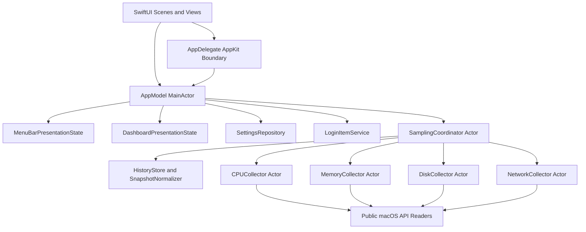

English | [简体中文](../../zh-CN/TS/PulseBar_Technical_Architecture_v1.0.md)

# PulseBar Technical Architecture (TS) v1.0

Product: PulseBar
Document version: 1.0
Last updated: 2026-08-31
Architecture status: implemented v1.0 baseline
Minimum system: macOS 13

## 1. Purpose

This document describes PulseBar v1.0 as implemented: architecture, concurrency, public system APIs, domain models, resource strategy, error boundaries, build validation, and future extension boundaries. It does not present planned v1.1 alert functionality as an existing component.

The [Product Requirements Document](../PRD/PulseBar_PRD_v1.0.md) owns product scope and acceptance definitions. Current evidence lives in the [Quality and Validation Report](../QUALITY_REPORT.md).

## 2. Goals and constraints

### 2.1 Goals

- Monitor CPU, memory, disk, and network in one native macOS menu bar process.
- Keep collection off the main actor, start four metric collectors concurrently per round, and prevent overlapping sampling loops.
- Degrade modules independently and never represent failure as a false zero.
- Bound history and rendered points so memory does not grow with uptime.
- Release full dashboard presentation state when hidden while preserving a lightweight menu bar summary.
- Make no runtime network connection, collect no data, and require no third-party framework.
- Build under Swift 6 complete concurrency checking and App Sandbox.

### 2.2 Hard constraints

- Minimum deployment target: macOS 13.
- Bundle ID: `com.pulsebar.PulseBar`.
- SwiftUI owns the primary UI; AppKit is limited to window lifecycle and system-integration boundaries.
- No command-line subprocess collects metrics.
- No private Framework, administrator access, or privileged helper.
- No sandbox network client or server entitlement.
- v1.0 contains no `AlertEngine`, notification service, persistent history, or export service.

## 3. Technical baseline

| Area | Choice |
|---|---|
| Language | Swift 6 with `SWIFT_STRICT_CONCURRENCY = complete` |
| UI | SwiftUI, `MenuBarExtra`, and `Settings` scene |
| AppKit boundary | `NSApplicationDelegate`, `NSWindow` activation/recovery, Activity Monitor entry |
| Concurrency | actors, structured concurrency, one sampling `Task` |
| Graphics | SwiftUI `Shape` / `Path`; no Charts linkage |
| State publication | MainActor `ObservableObject` with separate menu and dashboard state |
| Settings storage | sandboxed `UserDefaults` plus JSON `Codable` |
| History | fixed-capacity in-process ring buffers |
| Logging | Unified Logging through `OSLog.Logger` |
| Login item | `SMAppService.mainApp` |
| Build | Xcode app plus SwiftPM core, probes, and tests |
| Dependencies | Apple system Frameworks only; no third-party runtime dependency |

Release configuration enables App Sandbox, Hardened Runtime, warnings as errors, and complete concurrency checking.

## 4. Architecture



Dependencies point from presentation to application state, domain collection, and platform adapters. Platform readers do not depend on SwiftUI; collectors never publish directly to views; SwiftUI never calls Mach, BSD, or IOKit directly.

## 5. Source organization

```text
PulseBar/
  App/
  Features/
    Dashboard/
    MenuBar/
    Onboarding/
    Settings/
  Monitoring/
    Collectors/
    History/
    Models/
    Sampling/
  Platform/
    BSD/
    Foundation/
    IOKit/
    Mach/
    Network/
    ServiceManagement/
    SystemConfiguration/
  Resources/
  Shared/
    Formatting/
    Logging/
    Settings/
PulseBarTests/
Tools/
  PerformanceProbe/
  SystemMetricsProbe/
Scripts/
Config/
```

Responsibilities:

- **App**: scene composition, lifecycle, global settings, monitoring state, and presentation publication.
- **Features**: menu bar, cards, trends, Settings, onboarding, and recovery UI.
- **Monitoring**: domain snapshots, collectors, scheduling, normalization, history, and point reduction.
- **Platform**: minimal public system-API adapters and symmetric native-resource release.
- **Shared**: formatting, settings persistence, logging, and cross-feature types.
- **Tools/Scripts**: probes, benchmarks, sandbox, soak, packaging, and release gates that reuse production core code.
- **PulseBarTests**: algorithms, state, and collector behavior without requiring the production UI.

## 6. Scenes, windows, and application state

### 6.1 SwiftUI scenes

`PulseBarApp` creates:

- one `MenuBarExtra(...).menuBarExtraStyle(.window)`;
- one system `Settings` scene;
- one `@StateObject AppModel` as the application-state owner.

The label subscribes only to `MenuBarPresentationState`. The dashboard subscribes only to `DashboardPresentationState`. Settings binds to `AppModel.settings` so one metric update does not invalidate the entire settings UI.

### 6.2 AppKit window boundary

`AppDelegate` handles only window and lifecycle work that SwiftUI scenes do not perform reliably:

- onboarding window;
- menu bar recovery window;
- independent dashboard window;
- Settings registration, first creation, and existing-window activation;
- application reopen behavior.

Settings uses two paths:

1. If no window exists, SwiftUI `OpenSettingsAction` creates the scene and the actual window later registers.
2. If a window exists, PulseBar activates, deminiaturizes when necessary, and calls `makeKeyAndOrderFront`.

The Settings reference is weak so AppDelegate does not own the system scene's lifecycle.

### 6.3 AppModel

`AppModel` is `@MainActor` and owns:

- settings load, normalization, and save;
- sampling startup;
- snapshot-to-menu-summary conversion;
- full snapshot/history publication only while the dashboard is visible;
- pause, resume, sleep, wake, and volume-change events;
- login item, Dock icon, and reopen behavior;
- the at-least-one-menu-module invariant;
- onboarding and menu bar recovery state.

AppModel retains the latest domain snapshot for immediate content when the dashboard reopens. It does not retain a second chart-history copy.

## 7. Sampling concurrency

### 7.1 One coordinator

`SamplingCoordinator` is an actor and the only sampling-lifecycle owner. It contains one `samplingTask`:

- `start` samples immediately and then creates the loop;
- the loop waits for `sampleOnce` to return before the next delay, preventing reentrant rounds;
- `pause`, sleep, and `stop` cancel the task;
- policy or visibility changes rebuild the loop;
- sleep uses 10% interval tolerance so macOS can coalesce wake-ups.

### 7.2 Structured concurrency within a round

Each round captures one `ContinuousClock.Instant` and starts CPU, memory, disk, and network collectors through four `async let` bindings. Each collector is actor-isolated:

- previous-counter state cannot race within one collector;
- a slow collector does not prevent another from starting;
- all values still join in the coordinator to form one coherent `SystemSnapshot`;
- no unbounded task or per-chart timer is created.

### 7.3 Data flow

1. Capture monotonic time and increment `sequence`.
2. Start four collectors concurrently.
3. Build a raw `SystemSnapshot`.
4. Normalize temporary failures through `SnapshotNormalizer`.
5. Append usable values to `HistoryStore`.
6. Materialize `DashboardHistory` only while visible; otherwise use `.empty`.
7. Deliver to AppModel through an `@MainActor` callback.
8. Log a local sampling notice when a round exceeds 20 ms.

### 7.4 Refresh and lifecycle

| Policy | Dashboard visible | Dashboard hidden |
|---|---:|---:|
| adaptive | 1 s | 2 s |
| everySecond | 1 s | 1 s |
| everyTwoSeconds | 2 s | 2 s |
| everyFiveSeconds | 5 s | 5 s |

Sleep, wake, pause, and resume clear CPU, disk, and network delta baselines plus normalized prior values. The first recovered delta metric enters `warmingUp` instead of turning a long interval into a spike.

## 8. Domain model and state semantics

### 8.1 SystemSnapshot

Each snapshot contains:

- monotonic `sequence`;
- display-facing `wallTime`;
- `monotonicTime` for deltas and history trimming;
- one `MetricValue` each for CPU, memory, disk, and network.

Wall-clock changes do not affect rates. Monotonic time owns elapsed intervals.

### 8.2 MetricValue

`MetricValue<Value>` has four cases:

- `available(value)`: valid current data;
- `warmingUp`: no valid delta baseline yet;
- `unavailable(failure)`: current source is unavailable;
- `stale(value, age)`: recent value retained through a temporary failure.

`SnapshotNormalizer` keeps a recent value for at most 30 seconds after a failure, then returns unavailable. It does not substitute old values for warming state.

### 8.3 MetricFailure

A failure contains a stable code, user-message key, and optional local debug context. Formal codes are `permissionDenied`, `unsupported`, `systemCallFailed`, `invalidCounter`, and `sourceMissing`. Technical details never become first-screen copy and are never uploaded.

## 9. System metric collection

### 9.1 CPU

- `MachCPURawReader` calls `host_processor_info(PROCESSOR_CPU_LOAD_INFO)`.
- `CPUCollector` stores per-core prior ticks and calculates user, system, nice, and idle deltas.
- `getloadavg` provides 1-, 5-, and 15-minute load averages.
- Mach-allocated memory is released through `vm_deallocate` in `defer`.
- Core-count change, rollback, or zero interval rebuilds the baseline.
- Ratios require finite values and are clamped to 0...1.

### 9.2 Memory

- `MachMemoryRawReader` calls `host_page_size` and `host_statistics64(HOST_VM_INFO64)`.
- `sysctlbyname(vm.swapusage)` supplies swap.
- `SystemMemoryPressureMonitor` receives pressure events.
- Page-to-byte conversion rejects overflow.
- Approximate available is the saturating sum of free, inactive, speculative, and purgeable, bounded by physical total.
- Swap failure does not disable primary VM data.

### 9.3 Disk

Capacity path:

1. `FileManager.mountedVolumeURLs` enumerates non-hidden mounted volumes.
2. Public URL metadata provides identifier, name, local/internal, and removable attributes.
3. Explicit non-local volumes are discarded.
4. Darwin `statfs` reads each remaining volume.
5. `f_blocks * f_bsize` is total and `f_bavail * f_bsize` is ordinary available.
6. The root volume, then an internal volume, is chosen as primary.

Capacity is cached for 10 seconds and invalidated by volume-configuration changes. Production code does not read `volumeAvailableCapacityForImportantUsage` and therefore avoids `CacheDelete` purgeable-space work.

I/O path:

- `IOServiceGetMatchingServices(kIOBlockStorageDriverClass)`;
- cumulative read and written byte properties;
- registry-ID deduplication and overflow-safe adjacent deltas;
- iterator and service release through `IOObjectRelease` in `defer`.

If I/O fails, `DiskSnapshot` still carries capacity and independently marks `ioState` unavailable.

### 9.4 Network

- `NWPathMonitor` supplies path state and interface kind.
- `SystemPrimaryInterfaceResolver` uses SystemConfiguration.
- `BSDInterfaceCounterReader` reads `if_data` cumulative bytes through `getifaddrs`.
- `freeifaddrs` runs in `defer`.
- Candidate interfaces must be up, running, and non-loopback.
- Fallback priority is VPN, `en*`, then other interfaces.
- Interface change, rollback, or first sample after recovery enters warming.
- Session totals include only valid adjacent deltas and clear at exit.
- The model retains `localAddresses` for future compatibility, but v1.0 UI does not expose addresses and current collection returns an empty array.

## 10. Normalization, history, and graphics

### 10.1 Fixed history

`HistoryStore` keeps six `RingBuffer` instances with capacity 360:

- CPU usage;
- memory usage;
- disk read and write;
- network download and upload.

History trimming uses monotonic time and supports 60, 120, and 300 seconds. History exists only in process memory.

### 10.2 Point reduction

`TrendPointReducer` outputs at most 60 points by default:

- preserve first and last;
- divide interior samples into ordered buckets;
- preserve each bucket's local minimum and maximum in original order;
- remove duplicate sequence values;
- keep output monotonic.

Dual-throughput charts reduce each series separately, then share one sequence range for X coordinates so missing points do not misalign time.

### 10.3 Lightweight rendering

`LightweightTrendPlot` uses custom grid, line, and optional area `Shape` implementations with `Path.addLine`. Percentage charts use a fixed 0–100% axis; throughput charts use a shared dynamic upper bound and legend. Each chart is one accessibility element with a recent-value summary.

The application does not link `Charts.framework`, avoiding the former 134–140 MB physical footprint.

## 11. Presentation state and memory lifecycle

### 11.1 State separation

- `MenuBarPresentationState` stores only `MenuBarSummary`.
- `DashboardPresentationState.Content` stores `isVisible`, the full snapshot, and `DashboardHistory`.
- Both publish only when their values actually change.

### 11.2 Dashboard appears

- AppModel presents the latest snapshot immediately.
- The coordinator moves to the visible interval.
- One immediate sample runs.
- Subsequent delivery includes the chosen history window.

### 11.3 Dashboard hides

The menu-bar panel uses `DashboardView.onDisappear` to notify `AppModel`; the standalone window additionally uses `NSWindowDelegate.windowWillClose` to notify explicitly and unload Hosting content instead of depending only on a SwiftUI disappearance callback:

- `DashboardPresentationState.hide()` replaces content with empty state.
- `DashboardView` replaces the card tree with a same-size `Color.clear` shell.
- Adaptive sampling moves to two seconds.
- Fixed-capacity history continues, but arrays are not materialized for UI.
- The menu bar continues through the lightweight summary.

This path breaks Dashboard ownership of snapshot arrays, chart Shapes, and SwiftUI render layers. In the 2026-09-05 Release-AppStore hardware retest, the final 20 post-close seconds averaged 0.295% CPU, passing the below-1% hidden-state target. A 30-second Time Profiler trace measured 0.460% sampled CPU with no Dashboard stack. After settling, `NSWindow`, `NSHostingViewBase`, and `ViewGraphHost` were no longer live, and the `ViewGraph` count returned to the cold-launch baseline of six. Physical footprint remained near 30–32 MiB rather than the 16.4 MiB cold value, but repeated cycles did not grow and Leaks differed from cold launch only by a 32-byte system `NSXPCConnection` cycle, so the warm footprint is not evidence that the full Dashboard tree remains retained.

## 12. Menu bar rendering

Compact density uses one SwiftUI `Text` at 11 pt, medium rounded, monospaced digits, fixed-size single-line layout.

Standard and Complete use `MenuBarLabelImageRenderer` to produce a two-line template `NSImage`:

- 8 pt monospaced semibold;
- fixed 20 pt canvas height;
- -1 line spacing;
- minimum width from measured text;
- `isTemplate = true` for system appearance handling.

Each update disables SwiftUI transaction animation so numeric changes do not cause transient menu bar movement.

## 13. Settings and persistence

### 13.1 AppSettings

Schema version 2 contains:

- `launchAtLogin`, `showDockIcon`, `openBehavior`;
- `refreshPolicy`, `historyWindow`, `unitSystem`;
- `menuBarPreset`, `visibleModules`, `moduleOrder`, `showDecimals`;
- `language`.

`normalized()` deduplicates and completes order, aligns visible modules to that order, and guarantees one visible module.

### 13.2 SettingsRepository

Settings are JSON-encoded into sandboxed `UserDefaults`. The repository also stores onboarding completion and menu bar removal. Decode failure returns safe defaults. Resetting settings does not reset onboarding completion.

### 13.3 Vertical reordering

The right-side handle's `DragGesture` uses only `translation.height`:

- visual offset is Y-only;
- target index uses a 49 pt row stride;
- offset is clamped to list bounds;
- the complete row container follows the handle;
- release updates `moduleOrder` once;
- context-menu and accessibility-adjustable alternatives remain available.

### 13.4 System integration

- `SMAppService.mainApp.register/unregister` manages launch at login.
- `requiresApproval` exposes the System Settings entry.
- `NSApplication.ActivationPolicy` toggles the Dock icon.
- Reopen behavior keeps menu bar only or also opens an independent dashboard window.

## 14. Errors, logging, and degradation

- Each module returns its own `MetricValue` and one failure does not cancel another result.
- Disk capacity and I/O degrade independently; swap failure does not disable primary memory data.
- Settings and login-item failures appear through dismissible user prompts.
- The top-level state becomes “partially unavailable” when a module is unavailable.

`PulseBarLog` uses subsystem `com.pulsebar.PulseBar` and lifecycle, sampling, cpu, memory, disk, network, and settings categories. Logs remain in local Unified Logging, contain no sensitive content, and have no upload path.

## 15. Privacy and security architecture

- Entitlements contain only `com.apple.security.app-sandbox = true`.
- No `com.apple.security.network.client` or server entitlement.
- Metric reads are local system calls or system Framework queries.
- The source gate rejects `URLSession`, `NSURLConnection`, `CFHTTP`, `PrivateFrameworks`, and dynamic private loading.
- Runtime dependencies must resolve under `/System/Library` or `/usr/lib`.
- `PrivacyInfo.xcprivacy` ships in the app.
- Settings remain in the app container; metrics and history do not persist.
- No administrator, Full Disk Access, Accessibility permission, or account.

## 16. Performance and resource strategy

CPU:

- four collectors start concurrently;
- volume capacity is cached for 10 seconds;
- no purgeable-space API;
- adaptive hidden interval is two seconds;
- `Task.sleep` uses tolerance;
- menu and dashboard publication are separated;
- unchanged summaries are not republished.

Memory:

- six ring buffers of capacity 360;
- dashboard arrays materialize only while visible;
- at most 60 rendered points per series;
- hidden dashboard clears presentation and unloads cards;
- Mach, IOKit, and BSD resources release symmetrically through `defer`;
- no Swift Charts cache.

Raw-collector P95 budgets:

| Collector | Budget |
|---|---:|
| CPU | 3 ms |
| Memory | 3 ms |
| Network | 3 ms |
| Disk I/O | 8 ms |
| Volume capacity | 20 ms |

Application gates:

- visible dashboard peak below 60 MB;
- five-minute steady growth no more than 10 MB;
- adaptive hidden resident CPU target below 1%;
- no external socket in short validation;
- 8/24-hour and full Instruments validation remain distribution-stage work.

See [Quality and Validation](../QUALITY_REPORT.md) for measured values.

## 17. Build, test, and tooling

### 17.1 Xcode

`PulseBar.xcodeproj` builds the complete app, resources, scenes, and signing configurations: Debug, Release-AppStore, and Release-Direct. The local Release-AppStore gate currently uses ad-hoc identity with Hardened Runtime and App Sandbox. Real distribution must use the intended Apple Team, certificate, and profile.

### 17.2 SwiftPM

`Package.swift` provides:

- `PulseBarCore` library for Monitoring, Platform, and Shared core;
- `SystemMetricsProbe` executable for raw API and sandbox validation;
- `PerformanceProbe` executable for collector benchmarks;
- `PulseBarCoreTests` for core unit tests.

App, Features, and Resources are excluded from the core target so collection algorithms can run without UI.

### 17.3 Test coverage

The current 38 tests cover:

- four metric collectors;
- deltas, rollbacks, warming, and degradation;
- stale normalization;
- ring buffer and history windows;
- trend reduction and extrema preservation;
- formatting and units;
- settings normalization, persistence, and ordering;
- basic smoke tests for real readers.

### 17.4 Scripts

- `Scripts/verify-release.sh`: nine-stage local formal gate.
- `Scripts/verify-sandbox-probe.sh`: temporary sandboxed `.app` API probe.
- `Scripts/benchmark-metrics.sh`: Release collector P95.
- `Scripts/soak-test.sh`: explicit-duration stability observation.
- `Scripts/package-local-release.sh`: Universal `.app` and ZIP with local signing and artifact validation.

The repository currently has no hosted CI workflow. These scripts are the canonical local and future-CI entry points.

## 18. Current validation status

| Capability | Status |
|---|---|
| Swift 6 unit tests | 38 passed |
| Debug / Release arm64 | Passed |
| x86_64 | Cross-compilation passed; hardware pending |
| App Sandbox and ad-hoc Hardened Runtime | Locally passed |
| Collector performance budget | Passed |
| 120-second visible-chart memory budget | Passed |
| Five-minute steady state | Passed |
| Hidden-state low CPU | Passed; standalone-window final 20 post-close seconds average 0.295%, and a 30-second Time Profiler trace records 0.460% sampled CPU |
| Hidden-dashboard resource-release mechanism | Passed; close unloads Hosting content and settled window/Hosting/ViewGraph objects return to the cold baseline; warm footprint remains stable near 30–32 MiB |
| macOS 13/14/15 and Intel matrix | Pending |
| 8/24-hour and Instruments | Close-path Allocations, Leaks, and Time Profiler checked; soak, Energy, and Idle Wake Ups pending |
| Apple distribution signing, notarization, TestFlight/App Store | Pending |

## 19. v1.1 extension boundary

Alerts and notifications are future capabilities. v1.0 has no runtime `AlertEngine` or `NotificationService`. A future implementation must:

- consume normalized snapshots rather than call system APIs;
- support duration, recovery thresholds, and cooldown;
- request notification permission only after explicit user action;
- default every alert to off;
- preserve the no-external-network and local-processing boundary;
- complete independent performance, privacy, and product acceptance.

Persistent history and export should also remain removable extension layers and must not alter collectors' local, short-lifetime responsibilities.

## 20. Definition of Done

v1.0 engineering complete requires:

- implementation of formal PRD scope with no future feature on the runtime path;
- all `swift test` cases passing;
- `Scripts/verify-release.sh` passing;
- hardware regression for menu bar, dashboard, Settings, and recovery;
- chart memory, hidden CPU, and five-minute steady state within budget;
- consistent privacy, localization, support, quality, store, and release documents;
- independent Git checkpoints for milestones and important fixes.

Formal distribution additionally requires applicable device-matrix, soak, Apple signing/archive, and product approval in the [Release Checklist](../RELEASE_CHECKLIST.md). Engineering complete must not be described as App Store published.

## 21. References

- Apple Developer Documentation: SwiftUI `MenuBarExtra`, `Settings`, App Sandbox, `SMAppService`, Network, SystemConfiguration, and IOKit.
- Darwin / Mach: `host_processor_info`, `host_statistics64`, `host_page_size`, `sysctlbyname`, `getifaddrs`, and `statfs`.
- [System Metrics API Availability Report](Milestone_0_API_Availability_Report.md).
- Repository: <https://github.com/xiaolin0429/PulseBar>.
