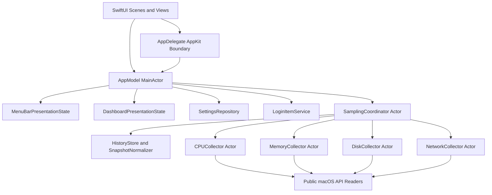

[English](../../en/TS/PulseBar_Technical_Architecture_v1.0.md) | 简体中文

# PulseBar 技术架构文档（TS）v1.0

产品：PulseBar
文档版本：1.0
更新日期：2026-08-31
架构状态：v1.0 已实现基线
最低系统：macOS 13

## 1. 文档目的

本文描述 PulseBar v1.0 当前真实实现的架构、线程模型、系统 API、数据模型、资源策略、错误边界、构建验证和后续扩展点。本文不把 v1.1 规划中的告警能力描述为现有组件。

产品范围和验收口径以[产品需求文档](../PRD/PulseBar_PRD_v1.0.md)为准；当前验证证据见[质量与验证报告](../QUALITY_REPORT.md)。

## 2. 架构目标与约束

### 2.1 目标

- 以一个原生 macOS 菜单栏进程完成 CPU、内存、磁盘和网络监控。
- 采集不阻塞主线程，四类指标同轮并发且不存在重叠采样循环。
- 数据失败按模块独立降级，UI 不将错误伪装成零值。
- 固定容量历史和有界绘制点避免内存随运行时间增长。
- 面板隐藏后释放完整展示状态，同时保持轻量菜单栏摘要。
- 运行时不联网、不收集数据、不依赖第三方框架。
- 在 Swift 6 完整并发检查和 App Sandbox 下构建。

### 2.2 明确约束

- 最低部署目标为 macOS 13。
- Bundle ID 为 `com.pulsebar.PulseBar`。
- 主应用以 SwiftUI 为主，仅在窗口和系统集成边界使用 AppKit。
- 不使用命令行子进程、私有 Framework、管理员权限或特权 Helper。
- 不启用沙盒网络客户端或服务端 entitlement。
- v1.0 不包含 `AlertEngine`、通知服务、持久化历史或导出服务。

## 3. 技术基线

| 领域 | 选择 |
|---|---|
| 语言 | Swift 6，`SWIFT_STRICT_CONCURRENCY = complete` |
| UI | SwiftUI、`MenuBarExtra`、`Settings` scene |
| AppKit 边界 | `NSApplicationDelegate`、`NSWindow` 前置/恢复、活动监视器入口 |
| 并发 | actor、结构化并发、单一采样 `Task` |
| 图形 | SwiftUI `Shape` / `Path`，不链接 Charts |
| 状态发布 | MainActor `ObservableObject`，菜单栏与面板分离 |
| 配置存储 | 沙盒内 `UserDefaults` + JSON `Codable` |
| 历史 | 进程内固定容量环形缓冲区 |
| 日志 | Unified Logging / `OSLog.Logger` |
| 登录项 | `SMAppService.mainApp` |
| 构建 | Xcode 主应用 + SwiftPM 核心库、探针和测试 |
| 依赖 | 仅 Apple 系统 Framework，无第三方运行时依赖 |

Release 配置启用 App Sandbox、Hardened Runtime、Swift 警告视为错误和完整并发检查。

## 4. 总体架构



依赖方向由展示层指向应用状态、领域采集和平台适配。平台 Reader 不依赖 SwiftUI；采集器不直接更新 UI；SwiftUI 不直接调用 Mach、BSD 或 IOKit。

## 5. 代码组织

当前正式目录：

```text
PulseBar/
  App/
  Features/
    Dashboard/
    MenuBar/
    Onboarding/
    Settings/
  Monitoring/
    Collectors/
    History/
    Models/
    Sampling/
  Platform/
    BSD/
    Foundation/
    IOKit/
    Mach/
    Network/
    ServiceManagement/
    SystemConfiguration/
  Resources/
  Shared/
    Formatting/
    Logging/
    Settings/
PulseBarTests/
Tools/
  PerformanceProbe/
  SystemMetricsProbe/
Scripts/
Config/
```

层职责：

- **App**：scene 组装、生命周期、全局设置、监控状态和展示状态发布。
- **Features**：菜单栏、卡片、趋势、设置、首次启动和恢复界面。
- **Monitoring**：领域快照、采集器、调度、状态归一化、历史与降采样。
- **Platform**：公开系统 API 的最小适配，负责资源释放和原始值转换。
- **Shared**：格式化、设置持久化、日志和跨功能基础类型。
- **Tools/Scripts**：复用正式核心代码的 API 探针、性能、长稳和发布门禁。
- **PulseBarTests**：不依赖真实 UI 的算法、状态和采集行为测试。

## 6. Scene、窗口与应用状态

### 6.1 SwiftUI Scene

`PulseBarApp` 创建：

- 一个 `MenuBarExtra(...).menuBarExtraStyle(.window)`；
- 一个系统 `Settings` scene；
- 一个 `@StateObject AppModel` 作为主应用状态所有者。

菜单栏标签只订阅 `MenuBarPresentationState`。监控面板只订阅 `DashboardPresentationState`。设置页绑定 `AppModel.settings`，避免全量快照变化使设置界面重绘。

### 6.2 AppKit 窗口边界

`AppDelegate` 只承担 SwiftUI scene 难以可靠完成的窗口和应用生命周期工作：

- 首次启动窗口；
- 菜单栏恢复窗口；
- 独立监控窗口；
- 设置窗口注册、首次创建和已有窗口前置；
- 应用重新打开行为。

设置按钮分两条路径：

1. 尚无设置窗口：调用 SwiftUI `OpenSettingsAction` 创建 scene，并等待窗口注册；
2. 已有设置窗口：激活应用，必要时取消最小化，再执行 `makeKeyAndOrderFront`。

`settingsWindow` 为弱引用，避免 AppDelegate 额外拥有系统设置窗口生命周期。

### 6.3 AppModel

`AppModel` 标注 `@MainActor`，负责：

- 加载、归一化和保存设置；
- 启动采样协调器；
- 将快照转换为菜单栏摘要；
- 仅在面板可见时发布完整快照与历史；
- 暂停、继续、睡眠、唤醒和卷变化事件；
- 登录项、Dock 图标和重新打开行为；
- 至少一个菜单栏模块约束；
- 首次启动与菜单栏恢复状态。

AppModel 只保存最近一个领域快照用于面板重开时立即填充，不保存图表历史副本。

## 7. 采样并发模型

### 7.1 单一协调器

`SamplingCoordinator` 是 actor，也是采样生命周期唯一所有者。内部只有一个 `samplingTask`：

- `start` 立即采样一次，然后创建循环；
- 循环在每轮 `sampleOnce` 返回后才等待下一次，不会并行重入；
- `pause`、睡眠和 `stop` 取消任务；
- 策略或面板可见性变化时重建循环；
- 定时等待使用间隔 10% 的 tolerance，允许系统合并唤醒。

### 7.2 同轮结构化并发

每轮以同一 `ContinuousClock.Instant` 为基准，并使用四个 `async let` 并发调用 CPU、内存、磁盘和网络采集器。四个采集器分别由 actor 隔离，因此：

- 同一采集器的前值基线不会竞争；
- 慢模块不会阻止其他模块开始；
- 结果在协调器统一汇合为一个 `SystemSnapshot`；
- 不创建无界任务，也不为每个图表建立定时器。

### 7.3 数据流

1. 获取单调时间并增加 `sequence`。
2. 同轮并发读取四类指标。
3. 组装原始 `SystemSnapshot`。
4. 由 `SnapshotNormalizer` 归一化临时失败。
5. 将可用值追加到 `HistoryStore`。
6. 面板可见时按所选窗口物化 `DashboardHistory`；隐藏时使用 `.empty`。
7. 通过 `@MainActor` delivery 返回 AppModel。
8. 单轮超过 20 ms 时写入本地 sampling notice。

### 7.4 刷新与生命周期

| 策略 | 面板可见 | 面板隐藏 |
|---|---:|---:|
| adaptive | 1 s | 2 s |
| everySecond | 1 s | 1 s |
| everyTwoSeconds | 2 s | 2 s |
| everyFiveSeconds | 5 s | 5 s |

睡眠、唤醒、暂停和继续会清除 CPU、磁盘、网络的差值基线以及 normalizer 旧值。恢复后的首个差值型指标进入 `warmingUp`，避免把长间隔显示为瞬时尖峰。

## 8. 领域模型与状态语义

### 8.1 SystemSnapshot

每个快照包含：

- 单调递增的 `sequence`；
- 用户展示使用的 `wallTime`；
- 差值和历史裁剪使用的 `monotonicTime`；
- CPU、内存、磁盘、网络四个 `MetricValue`。

壁钟变化不影响速率；单调时间负责样本间隔和历史窗口。

### 8.2 MetricValue

`MetricValue<Value>` 有四种状态：

- `available(value)`：当前样本有效；
- `warmingUp`：尚未建立差值基线；
- `unavailable(failure)`：当前来源不可用；
- `stale(value, age)`：短时失败时保留最近有效值并标记年龄。

`SnapshotNormalizer` 对临时失败最多保留 30 秒旧值，之后转为不可用。预热状态不复用旧值，以免恢复阶段呈现误导性速率。

### 8.3 MetricFailure

错误由稳定 code、用户文案 key 和可选本地 debug context 组成。code 包括 `permissionDenied`、`unsupported`、`systemCallFailed`、`invalidCounter` 和 `sourceMissing`。技术错误不直接作为首屏 UI 文案，也不上传。

## 9. 系统指标采集

### 9.1 CPU

- `MachCPURawReader` 调用 `host_processor_info(PROCESSOR_CPU_LOAD_INFO)`。
- `CPUCollector` 保存每个逻辑核心前值并计算 user、system、nice 和 idle 差值。
- `getloadavg` 读取 1/5/15 分钟负载平均值。
- Mach 返回内存在 `defer` 中使用 `vm_deallocate` 释放。
- 核心数量变化、计数回绕或零时间窗均重建基线。
- 比例执行 finite 检查并限制在 0...1。

### 9.2 内存

- `MachMemoryRawReader` 使用 `host_page_size` 和 `host_statistics64(HOST_VM_INFO64)`。
- `sysctlbyname(vm.swapusage)` 读取 Swap。
- `SystemMemoryPressureMonitor` 接收系统压力事件。
- 页数到字节使用溢出安全乘法。
- 近似可用内存为 free、inactive、speculative、purgeable 的饱和求和并限制到物理内存总量。
- Swap 读取失败不使 VM 主指标整体失败。

### 9.3 磁盘

容量路径：

1. `FileManager.mountedVolumeURLs` 枚举非隐藏挂载卷；
2. 读取卷标识、名称、本地、内置和可移除元数据；
3. 丢弃明确的非本地卷；
4. 对每个卷调用 Darwin `statfs`；
5. 以 `f_blocks * f_bsize` 计算总量，`f_bavail * f_bsize` 计算普通可用量；
6. 优先根卷，其次内置卷作为主卷。

容量缓存 10 秒，卷配置变化会主动失效。正式代码不读取 `volumeAvailableCapacityForImportantUsage`，避免 `CacheDelete` 可清理空间工作。

I/O 路径：

- `IOServiceGetMatchingServices(kIOBlockStorageDriverClass)`；
- 读取块设备累计 read/write bytes；
- 以 registry ID 去重并做溢出安全差值；
- iterator 和 service 对象均在 `defer` 中 `IOObjectRelease`。

I/O 失败时 `DiskSnapshot` 仍携带容量，`ioState` 独立标记不可用。

### 9.4 网络

- `NWPathMonitor` 提供路径状态和接口类型。
- `SystemPrimaryInterfaceResolver` 通过 SystemConfiguration 解析主接口。
- `BSDInterfaceCounterReader` 通过 `getifaddrs` 与 `if_data` 读取累计字节。
- Reader 在 `defer` 中调用 `freeifaddrs`。
- 候选接口必须 up、running 且非 loopback。
- 主接口缺失时，按 VPN、`en*`、其他接口的稳定优先级回退。
- 接口变化、计数回绕和恢复首样本进入预热。
- 会话累计只统计有效相邻样本，退出后清除。
- 模型保留 `localAddresses` 字段，但 v1.0 界面不展示地址，当前值为空数组。

## 10. 归一化、历史与图形

### 10.1 固定容量历史

`HistoryStore` 为 CPU usage、memory usage、disk read/write、network download/upload 六条序列分别维护容量 360 的 `RingBuffer`。窗口裁剪使用单调时间，可选择 60、120、300 秒。历史只存在于内存。

### 10.2 绘制点压缩

`TrendPointReducer` 默认最多输出 60 点：

- 始终保留首尾点；
- 中间样本按有序桶划分；
- 每桶按原序保留局部最小值和最大值；
- 去除重复 sequence；
- 保持输出顺序单调。

双序列吞吐图分别压缩后共享 sequence 范围计算 X 坐标，避免缺失点造成时间轴错位。

### 10.3 轻量绘制

`LightweightTrendPlot` 使用自定义网格、折线和可选面积 `Shape`，通过 `Path.addLine` 绘制。百分比图使用固定 0–100% 轴；吞吐图使用共享动态上界和图例。图表作为单一辅助功能元素输出最近值。

正式应用不链接 `Charts.framework`，避免旧路径 134–140 MB 的 physical footprint。

## 11. 展示状态与内存生命周期

### 11.1 状态拆分

- `MenuBarPresentationState` 只保存 `MenuBarSummary`。
- `DashboardPresentationState.Content` 保存 `isVisible`、完整快照和 `DashboardHistory`。
- 两者只在值实际变化时发布。

### 11.2 面板出现

- AppModel 先用最近快照填充；
- 协调器切换到可见刷新间隔；
- 主动执行一次采样；
- 后续发布完整快照和所选历史窗口。

### 11.3 面板隐藏

菜单栏面板隐藏时由 `DashboardView.onDisappear` 通知 `AppModel`；独立窗口另由 `NSWindowDelegate.windowWillClose` 显式通知并卸载 Hosting 内容，避免只依赖 SwiftUI 消失回调：

- `DashboardPresentationState.hide()` 将内容替换为空。
- `DashboardView` 用同尺寸 `Color.clear` 壳替换卡片树。
- 自适应策略切换为两秒。
- 历史继续固定容量写入，但不物化数组给 UI。
- 菜单栏继续接收轻量摘要。

该路径用于解除 Dashboard 对快照数组、图形 Shape 和 SwiftUI 渲染层的持有。2026-09-05 的 Release-AppStore 真机复测中，独立窗口关闭后最后 20 秒 CPU 平均为 0.295%，满足隐藏态低于 1% 的目标；Time Profiler 的 30 秒录制为 0.460% 采样 CPU，未出现 Dashboard 调用栈。静默后 `NSWindow`、`NSHostingViewBase`、`ViewGraphHost` 均不再存活，`ViewGraph` 数量回到冷启的 6 个。physical footprint 保持约 30–32 MiB，高于 16.4 MiB 冷启值，但多次开关没有持续增长，Leaks 与冷启只相差 32 B 的系统 `NSXPCConnection` 循环，因此不作为完整 Dashboard 树仍被持有的证据。

## 12. 菜单栏渲染

简洁密度使用单行 SwiftUI `Text`：11 pt、medium、rounded、`monospacedDigit` 和固定尺寸。

标准与完整密度由 `MenuBarLabelImageRenderer` 渲染两行模板 `NSImage`：

- 8 pt 等宽半粗体；
- 20 pt 固定画布高度；
- 负一行距；
- 按文本测量得到最小宽度；
- `isTemplate = true`，由系统处理明暗外观。

每次更新关闭 SwiftUI transaction 动画，避免数字变化时菜单栏短暂漂移。

## 13. 设置与持久化

### 13.1 AppSettings

schema 版本为 2，字段包括：

- `launchAtLogin`、`showDockIcon`、`openBehavior`；
- `refreshPolicy`、`historyWindow`、`unitSystem`；
- `menuBarPreset`、`visibleModules`、`moduleOrder`、`showDecimals`；
- `language`。

`normalized()` 去重并补齐模块顺序，按顺序排列可见模块，并保证至少一个模块。

### 13.2 SettingsRepository

设置以 JSON 编码后写入沙盒内 `UserDefaults`。Repository 同时保存首次启动完成和菜单栏移除状态。解码失败回到安全默认值；恢复默认不重置首次启动完成状态。

### 13.3 垂直排序

右侧句柄的 `DragGesture` 只读取 `translation.height`：

- 视觉 offset 只作用于 Y 轴；
- 按 49 pt 行步长计算目标索引；
- 偏移限制在列表首尾；
- 完整行容器随句柄移动；
- 松手后一次性更新 `moduleOrder`；
- 上下文菜单和辅助功能 adjustable action 提供替代操作。

### 13.4 系统集成

- 登录项由 `SMAppService.mainApp.register/unregister` 管理；
- `requiresApproval` 时提供系统设置入口；
- Dock 图标通过 `NSApplication.ActivationPolicy` 切换；
- 重新打开应用时可仅恢复菜单栏或打开独立监控窗口。

## 14. 错误、日志与降级

- 四类模块分别返回 `MetricValue`，任一失败不取消其他正常结果。
- 磁盘容量与 I/O 独立降级；Swap 失败不使内存主指标失败。
- 设置和登录项错误通过可关闭提示展示。
- 存在不可用模块时，顶层状态显示“部分指标不可用”。

`PulseBarLog` 使用 subsystem `com.pulsebar.PulseBar`，分类为 lifecycle、sampling、cpu、memory、disk、network 和 settings。日志只进入本机 Unified Logging，不记录敏感内容，也没有上传路径。

## 15. 隐私与安全架构

- Entitlements 仅包含 `com.apple.security.app-sandbox = true`。
- 不包含 `com.apple.security.network.client` 或 server。
- 指标读取均为本机系统调用或系统 Framework 查询。
- 门禁禁止 `URLSession`、`NSURLConnection`、`CFHTTP`、`PrivateFrameworks` 和动态私有加载。
- 运行时依赖必须位于 `/System/Library` 或 `/usr/lib`。
- `PrivacyInfo.xcprivacy` 随应用打包。
- 设置保存在应用容器；指标和历史不落盘。
- 无管理员权限、完全磁盘访问、辅助功能权限或用户账户。

## 16. 性能与资源策略

CPU：

- 四类采集同轮并发；
- 卷容量缓存 10 秒；
- 不调用可清理空间 API；
- 自适应隐藏态为两秒；
- `Task.sleep` 使用 tolerance；
- 菜单栏与 Dashboard 独立发布；
- 仅在值变化时发布摘要。

内存：

- 六个容量 360 的环形缓冲区；
- Dashboard 数组只在可见时物化；
- 每条图形最多 60 点；
- 面板隐藏清空展示状态并卸载卡片树；
- Mach、IOKit、BSD 资源通过 `defer` 对称释放；
- 不依赖 Swift Charts 图形缓存。

原始采集 P95 预算：

| 项目 | 预算 |
|---|---:|
| CPU | 3 ms |
| Memory | 3 ms |
| Network | 3 ms |
| Disk I/O | 8 ms |
| Volume capacity | 20 ms |

应用门禁：

- 面板持续绘制峰值低于 60 MB；
- 五分钟稳态增长不超过 10 MB；
- 默认隐藏态常驻 CPU 目标低于 1%；
- 短时验证不出现外部 socket；
- 8/24 小时和完整 Instruments 属于发行阶段。

详细数字见[质量与验证报告](../QUALITY_REPORT.md)。

## 17. 构建、测试与工具链

### 17.1 Xcode

`PulseBar.xcodeproj` 负责完整 App、资源、scene 和签名，提供 Debug、Release-AppStore 和 Release-Direct 配置。Release-AppStore 当前本地门禁使用 ad-hoc 身份并启用 Hardened Runtime 和 App Sandbox；正式发行必须使用对应 Apple Team、证书和 Profile。

### 17.2 SwiftPM

`Package.swift` 提供：

- `PulseBarCore` library：Monitoring、Platform 和 Shared 核心；
- `SystemMetricsProbe` executable：原始 API 与沙盒可用性；
- `PerformanceProbe` executable：采集性能基准；
- `PulseBarCoreTests`：核心单元测试。

App、Features 和 Resources 不进入核心 target，使采集算法可在无 UI 环境中测试。

### 17.3 测试

当前 38 项测试覆盖：

- 四类采集器；
- 差值、回绕、预热和错误降级；
- stale 归一化；
- 环形缓冲区与历史窗口；
- 趋势压缩和峰谷保留；
- 格式化与单位；
- 设置归一化、持久化和排序；
- 真实 Reader 基础 smoke。

### 17.4 脚本

- `Scripts/verify-release.sh`：九段本地正式门禁。
- `Scripts/verify-sandbox-probe.sh`：临时沙盒 `.app` API 探针。
- `Scripts/benchmark-metrics.sh`：Release 原始采集 P95。
- `Scripts/soak-test.sh`：显式时长稳定性观察。
- `Scripts/package-local-release.sh`：Universal `.app` 与 ZIP、本地签名和产物校验。

仓库当前未配置托管 CI；上述脚本是本机及未来 CI 可复用的统一入口。

## 18. 当前验证状态

| 能力 | 状态 |
|---|---|
| Swift 6 单元测试 | 38 项通过 |
| Debug / Release arm64 | 通过 |
| x86_64 | 交叉编译通过，实机待验证 |
| App Sandbox 与 ad-hoc Hardened Runtime | 本地通过 |
| 采集性能预算 | 通过 |
| 图形 120 秒内存预算 | 通过 |
| 五分钟稳态 | 通过 |
| 隐藏态低 CPU | 通过；独立窗口关闭后最后 20 秒平均 0.295%，Time Profiler 30 秒为 0.460% 采样 CPU |
| 隐藏面板资源释放机制 | 通过；关闭后卸载 Hosting 内容，静默后窗口/Hosting/ViewGraph 对象回到冷启基线；暖态 footprint 稳定在约 30–32 MiB |
| macOS 13/14/15 与 Intel 矩阵 | 待验证 |
| 8/24 小时与 Instruments | 关闭路径的 Allocations、Leaks、Time Profiler 已复核；长稳、Energy 与 Idle Wake Ups 待验证 |
| Apple 发行签名、公证、TestFlight/App Store | 待执行 |

## 19. v1.1 扩展边界

告警和通知属于未来能力，v1.0 不存在运行时 `AlertEngine` 或 `NotificationService`。未来接入必须：

- 只消费归一化快照，不直接读取系统 API；
- 支持持续时间、恢复阈值和冷却；
- 通知权限由用户明确触发；
- 默认不开启告警；
- 不改变零外部网络和本机处理边界；
- 独立完成性能、隐私和产品验收。

长期历史与导出也应作为可移除扩展层，不修改采集器的纯本地、短生命周期职责。

## 20. Definition of Done

v1.0 工程完成必须同时满足：

- PRD 正式范围实现，非本期能力未混入运行路径；
- `swift test` 全部通过；
- `Scripts/verify-release.sh` 全部通过；
- 菜单栏、面板、设置和恢复路径完成真机回归；
- 图形内存、隐藏态 CPU 和五分钟稳态达到预算；
- 隐私、本地化、支持、质量、商店和发布文档一致；
- 里程碑与重要修复均保存独立 Git 节点。

正式发行还必须完成[发布清单](../RELEASE_CHECKLIST.md)中的设备矩阵、长稳、Apple 签名/归档和产品批准。工程完成不得表述为 App Store 已发布。

## 21. 参考

- Apple Developer Documentation：SwiftUI `MenuBarExtra`、`Settings`、App Sandbox、`SMAppService`、Network、SystemConfiguration 和 IOKit。
- Darwin / Mach：`host_processor_info`、`host_statistics64`、`host_page_size`、`sysctlbyname`、`getifaddrs`、`statfs`。
- [系统指标 API 可用性报告](Milestone_0_API_Availability_Report.md)。
- 项目仓库：<https://github.com/xiaolin0429/PulseBar>。
